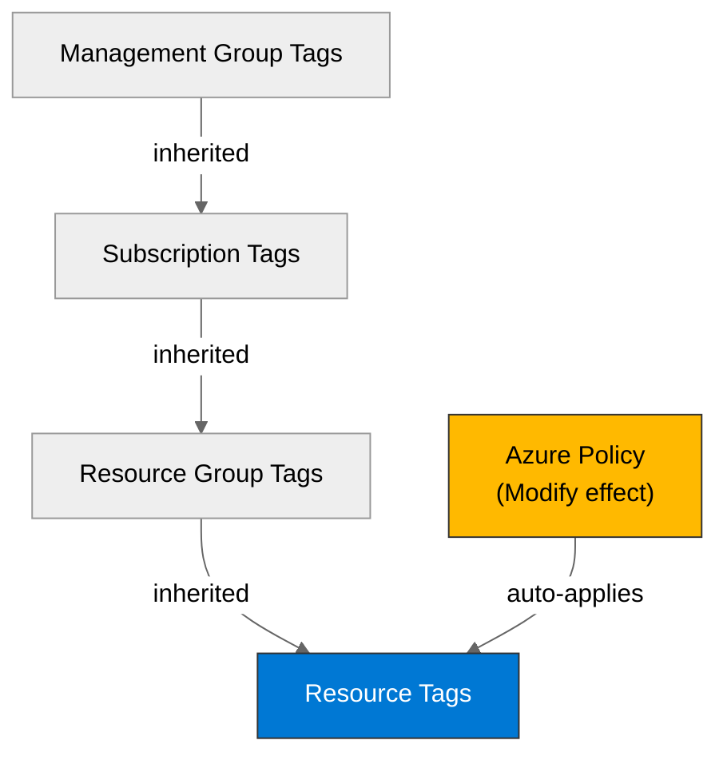

# 🛡️ Governance Constraints - vnext-qualification

<strong>📑 Governance Contents</strong>

- [🔍 Discovery Source](#-discovery-source)
- [📋 Azure Policy Compliance](#-azure-policy-compliance)
- [🔄 Plan Adaptations Based on Policies](#-plan-adaptations-based-on-policies)
- [🚫 Deployment Blockers](#-deployment-blockers)
- [🏷️ Required Tags](#-required-tags)
- [🔐 Security Policies](#-security-policies)
- [💰 Cost Policies](#-cost-policies)
- [🌐 Network Policies](#-network-policies)
- [📜 Compliance Frameworks](#-compliance-frameworks)
- [References](#references)
- [Approved Security Exception](#approved-security-exception)

> Generated by 04g-Governance agent | 2026-07-15T12:08:09Z

| ⬅️ Previous | 📑 Index | Next ➡️ |
| --- | --- | --- |
| [02-architecture-assessment.md](02-architecture-assessment.md) | [README](README.md) | [04-implementation-plan.md](04-implementation-plan.md) |

## 🔍 Discovery Source

| Query | Results | Timestamp |
| --- | --- | --- |
| Policy Assignments | 33 policies discovered | 2026-07-15T12:08:09Z |
| Tag Policies | 12 tags required | 2026-07-15T12:08:09Z |
| Security Policies | 1 constraints | 2026-07-15T12:08:09Z |

**Discovery Method**: Azure Policy REST API (discover.py)
**Subscription**: 00858ffc-dded-4f0f-8bbf-e17fff0d47d9
**Scope**: Subscription + management-group inherited

> ⚠️ **8 deployment blocker(s)** detected. Review the [Deployment Blockers](#-deployment-blockers) section before proceeding to IaC planning.

### Policy Definition Analysis

| Policy Display Name | Assignment Scope | Effect | Classification | Category | Bicep Property Path | Required Value |
| --- | --- | --- | --- | --- | --- | --- |
| Block VM SKU Sizes | /providers/Microsoft.Management/managementGroups/2d04cb4c-999b-4e60-a3a7-e8993edc768b | deny | blocker | Compute |  |  |
| Deny AKS deployment with agent pool count greater than 10 | /providers/Microsoft.Management/managementGroups/2d04cb4c-999b-4e60-a3a7-e8993edc768b | deny | blocker | Compute | managedClusters::agentPoolProfiles[*] |  |
| Deny VMSS deployment with instance count greater than 10 | /providers/Microsoft.Management/managementGroups/2d04cb4c-999b-4e60-a3a7-e8993edc768b | deny | blocker | Compute | virtualMachineScaleSets::sku.capacity |  |
| Block Azure OpenAI Provisioned Capacity | /providers/Microsoft.Management/managementGroups/2d04cb4c-999b-4e60-a3a7-e8993edc768b | deny | blocker | Cognitive Services | accounts/deployments::sku.name |  |
| Block Azure Sentinel Commitment over 100 | /providers/Microsoft.Management/managementGroups/2d04cb4c-999b-4e60-a3a7-e8993edc768b | deny | blocker | Monitoring | workspaces::sku.capacityReservationLevel |  |
| Deny Azure Key Vault Managed HSM with Purge Protection Enabled | /providers/Microsoft.Management/managementGroups/2d04cb4c-999b-4e60-a3a7-e8993edc768b | deny | blocker | Key Vault |  |  |
| Deploy the Windows Guest Configuration extension to enable Guest Configuration assignments on Windows VMs | /providers/Microsoft.Management/managementGroups/2d04cb4c-999b-4e60-a3a7-e8993edc768b | deployIfNotExists | auto-remediate | Guest Configuration | virtualMachines::extensions/provisioningState |  |
| Add system-assigned managed identity to enable Guest Configuration assignments on virtual machines with no identities | /providers/Microsoft.Management/managementGroups/2d04cb4c-999b-4e60-a3a7-e8993edc768b | modify | auto-remediate | Managed Identity for Guest Configuration | virtualMachines::storageProfile.osDisk.osType | SystemAssigned |
| Add system-assigned managed identity to enable Guest Configuration assignments on VMs with a user-assigned identity | /providers/Microsoft.Management/managementGroups/2d04cb4c-999b-4e60-a3a7-e8993edc768b | modify | auto-remediate | Managed identity for Guest Configuration | virtualMachines::storageProfile.osDisk.osType | [concat(field('identity.type'), ',SystemAssigned')] |
| Ensure secure access to storage account containers | /providers/Microsoft.Management/managementGroups/2d04cb4c-999b-4e60-a3a7-e8993edc768b | modify | auto-remediate | Modify Allow Blob anonymous access | resourceGroups::tags | false |
| Deploy Resource Group McapsGovernance | /providers/Microsoft.Management/managementGroups/2d04cb4c-999b-4e60-a3a7-e8993edc768b | deployIfNotExists | auto-remediate | Uncategorized |  |  |
| Deploy Storage Account for Diagnostic Settings | /providers/Microsoft.Management/managementGroups/2d04cb4c-999b-4e60-a3a7-e8993edc768b | deployIfNotExists | auto-remediate | Uncategorized |  |  |
| JV - Inherit Multiple Tags from Resource Group | /providers/Microsoft.Management/managementGroups/2d04cb4c-999b-4e60-a3a7-e8993edc768b | modify | auto-remediate | Tags |  | environment |
| Block Azure RM Resource Creation | /providers/Microsoft.Management/managementGroups/2d04cb4c-999b-4e60-a3a7-e8993edc768b | deny | blocker | Uncategorized |  |  |
| JV-Enforce Resource Group Tags | /providers/Microsoft.Management/managementGroups/2d04cb4c-999b-4e60-a3a7-e8993edc768b | deny | blocker | Tags | resourceGroups::tags |  |
| Add system-assigned managed identity to enable Guest Configuration assignments on virtual machines with no identities | /providers/Microsoft.Management/managementGroups/alz | modify | auto-remediate | Guest Configuration | virtualMachines::storageProfile.osDisk.osType | SystemAssigned |
| Deploy the Linux Guest Configuration extension to enable Guest Configuration assignments on Linux VMs | /providers/Microsoft.Management/managementGroups/alz | deployIfNotExists | auto-remediate | Guest Configuration | virtualMachines::extensions/provisioningState |  |
| Deploy the Windows Guest Configuration extension to enable Guest Configuration assignments on Windows VMs | /providers/Microsoft.Management/managementGroups/alz | deployIfNotExists | auto-remediate | Guest Configuration | virtualMachines::extensions/provisioningState |  |
| Deploy Service Health Action Group | /providers/Microsoft.Management/managementGroups/alz | deployIfNotExists | auto-remediate | Monitoring |  | rg-amba-monitoring-001 |
| Deploy AMBA Notification Assets | /providers/Microsoft.Management/managementGroups/alz | deployIfNotExists | auto-remediate | Monitoring |  | rg-amba-monitoring-001 |
| Deploy AMBA Notification Suppression Asset | /providers/Microsoft.Management/managementGroups/alz | deployIfNotExists | auto-remediate | Monitoring |  | rg-amba-monitoring-001 |
| Deploy export to Log Analytics workspace for Microsoft Defender for Cloud data | /providers/Microsoft.Management/managementGroups/alz | deployIfNotExists | auto-remediate | Security Center |  | vella.jonathan@outlook.com |
| Configure Azure Defender to be enabled on SQL servers | /providers/Microsoft.Management/managementGroups/alz | deployIfNotExists | auto-remediate | SQL |  |  |
| Inherit a tag from the resource group | /providers/Microsoft.Management/managementGroups/alz | modify | auto-remediate | Tags |  | [resourceGroup().tags[parameters('tagName')]] |

## 📋 Azure Policy Compliance

> **Note**: No architecture assessment provided. IaC impact annotations will be populated during Step 4 (IaC Planning).

| Category | Constraint | Implementation | Status |
| --- | --- | --- | --- |
| Cognitive Services | Block Azure OpenAI Provisioned Capacity | Blocked — must comply before deployment | ❌ |
| Compute | Block VM SKU Sizes | Blocked — must comply before deployment | ❌ |
| Compute | Deny AKS deployment with agent pool count greater than 10 | Blocked — must comply before deployment | ❌ |
| Compute | Deny VMSS deployment with instance count greater than 10 | Blocked — must comply before deployment | ❌ |
| Guest Configuration | Deploy the Windows Guest Configuration extension to enable Guest Configuration assignments on Windows VMs | Auto-applied by Azure Policy | ✅ |
| Guest Configuration | Add system-assigned managed identity to enable Guest Configuration assignments on virtual machines with no identities | Auto-applied by Azure Policy | ✅ |
| Guest Configuration | Deploy the Linux Guest Configuration extension to enable Guest Configuration assignments on Linux VMs | Auto-applied by Azure Policy | ✅ |
| Guest Configuration | Deploy the Windows Guest Configuration extension to enable Guest Configuration assignments on Windows VMs | Auto-applied by Azure Policy | ✅ |
| Key Vault | Deny Azure Key Vault Managed HSM with Purge Protection Enabled | Blocked — must comply before deployment | ❌ |
| Managed Identity for Guest Configuration | Add system-assigned managed identity to enable Guest Configuration assignments on virtual machines with no identities | Auto-applied by Azure Policy | ✅ |
| Managed identity for Guest Configuration | Add system-assigned managed identity to enable Guest Configuration assignments on VMs with a user-assigned identity | Auto-applied by Azure Policy | ✅ |
| Modify Allow Blob anonymous access | Ensure secure access to storage account containers | Auto-applied by Azure Policy | ✅ |
| Monitoring | Block Azure Sentinel Commitment over 100 | Blocked — must comply before deployment | ❌ |
| Monitoring | Deploy Service Health Action Group | Auto-applied by Azure Policy | ✅ |
| Monitoring | Deploy AMBA Notification Assets | Auto-applied by Azure Policy | ✅ |
| Monitoring | Deploy AMBA Notification Suppression Asset | Auto-applied by Azure Policy | ✅ |
| SQL | Configure Azure Defender to be enabled on SQL servers | Auto-applied by Azure Policy | ✅ |
| Security Center | Deploy export to Log Analytics workspace for Microsoft Defender for Cloud data | Auto-applied by Azure Policy | ✅ |
| Tags | JV - Inherit Multiple Tags from Resource Group | Auto-applied by Azure Policy | ✅ |
| Tags | JV-Enforce Resource Group Tags | Blocked — must comply before deployment | ❌ |
| Tags | Inherit a tag from the resource group | Auto-applied by Azure Policy | ✅ |
| Uncategorized | Deploy Resource Group McapsGovernance | Auto-applied by Azure Policy | ✅ |
| Uncategorized | Deploy Storage Account for Diagnostic Settings | Auto-applied by Azure Policy | ✅ |
| Uncategorized | Block Azure RM Resource Creation | Blocked — must comply before deployment | ❌ |

## 🔄 Plan Adaptations Based on Policies

### Architectural Changes

| Original Design | Blocking Policy | Effect | Adaptation Applied |
| --- | --- | --- | --- |
| No architecture target | Block VM SKU Sizes | deny | Review at Step 4 IaC Planning |
| No architecture target | Deny AKS deployment with agent pool count greater than 10 | deny | Review at Step 4 IaC Planning |
| No architecture target | Deny VMSS deployment with instance count greater than 10 | deny | Review at Step 4 IaC Planning |
| No architecture target | Block Azure OpenAI Provisioned Capacity | deny | Review at Step 4 IaC Planning |
| No architecture target | Block Azure Sentinel Commitment over 100 | deny | Review at Step 4 IaC Planning |
| No architecture target | Deny Azure Key Vault Managed HSM with Purge Protection Enabled | deny | Review at Step 4 IaC Planning |
| No architecture target | Block Azure RM Resource Creation | deny | Review at Step 4 IaC Planning |
| No architecture target | JV-Enforce Resource Group Tags | deny | Review at Step 4 IaC Planning |

### Auto-Applied Resources

| Policy | Effect | Auto-Applied Resource |
| --- | --- | --- |
| Deploy the Windows Guest Configuration extension to enable Guest Configuration assignments on Windows VMs | DeployIfNotExists | Auto-deployed by Azure Policy |
| Deploy Resource Group McapsGovernance | DeployIfNotExists | Auto-deployed by Azure Policy |
| Deploy Storage Account for Diagnostic Settings | DeployIfNotExists | Auto-deployed by Azure Policy |
| Deploy the Linux Guest Configuration extension to enable Guest Configuration assignments on Linux VMs | DeployIfNotExists | Auto-deployed by Azure Policy |
| Deploy the Windows Guest Configuration extension to enable Guest Configuration assignments on Windows VMs | DeployIfNotExists | Auto-deployed by Azure Policy |
| Deploy Service Health Action Group | DeployIfNotExists | Auto-deployed by Azure Policy |
| Deploy AMBA Notification Assets | DeployIfNotExists | Auto-deployed by Azure Policy |
| Deploy AMBA Notification Suppression Asset | DeployIfNotExists | Auto-deployed by Azure Policy |
| Deploy export to Log Analytics workspace for Microsoft Defender for Cloud data | DeployIfNotExists | Auto-deployed by Azure Policy |
| Configure Azure Defender to be enabled on SQL servers | DeployIfNotExists | Auto-deployed by Azure Policy |

### Auto-Modified Configurations

| Policy | Effect | Auto-Applied Change |
| --- | --- | --- |
| Add system-assigned managed identity to enable Guest Configuration assignments on virtual machines with no identities | Modify | Auto-modified by Azure Policy |
| Add system-assigned managed identity to enable Guest Configuration assignments on VMs with a user-assigned identity | Modify | Auto-modified by Azure Policy |
| Ensure secure access to storage account containers | Modify | Auto-modified by Azure Policy |
| JV - Inherit Multiple Tags from Resource Group | Modify | Auto-modified by Azure Policy |
| Add system-assigned managed identity to enable Guest Configuration assignments on virtual machines with no identities | Modify | Auto-modified by Azure Policy |
| Inherit a tag from the resource group | Modify | Auto-modified by Azure Policy |

## 🚫 Deployment Blockers

> **8** blocker finding(s) from **8** unique policies (duplicates from multi-scope inheritance are consolidated below).

### Block VM SKU Sizes

- **Policy ID**: `/providers/Microsoft.Management/managementGroups/2d04cb4c-999b-4e60-a3a7-e8993edc768b/providers/Microsoft.Authorization/policyDefinitions/VirtualMachine_SKU_Deny`
- **Effect**: deny
- **Scope**: /providers/Microsoft.Management/managementGroups/2d04cb4c-999b-4e60-a3a7-e8993edc768b
- **Category**: Compute
- **Bicep Property Path**: ``
- **Required Value**: N/A — parameter values not available in cached baseline; run `--refresh` for live lookup

> **Resolution**: Review during Step 4 IaC Planning — apply an exemption, use an allowed alternative, or update the policy scope.

### Deny AKS deployment with agent pool count greater than 10

- **Policy ID**: `/providers/Microsoft.Management/managementGroups/2d04cb4c-999b-4e60-a3a7-e8993edc768b/providers/Microsoft.Authorization/policyDefinitions/AKS_LimitNodeCount_Deny`
- **Effect**: deny
- **Scope**: /providers/Microsoft.Management/managementGroups/2d04cb4c-999b-4e60-a3a7-e8993edc768b
- **Category**: Compute
- **Bicep Property Path**: `managedClusters::agentPoolProfiles[*]`
- **Required Value**: N/A — parameter values not available in cached baseline; run `--refresh` for live lookup

> **Resolution**: Review during Step 4 IaC Planning — apply an exemption, use an allowed alternative, or update the policy scope.

### Deny VMSS deployment with instance count greater than 10

- **Policy ID**: `/providers/Microsoft.Management/managementGroups/2d04cb4c-999b-4e60-a3a7-e8993edc768b/providers/Microsoft.Authorization/policyDefinitions/VMSS_LimitNodesCount_Deny`
- **Effect**: deny
- **Scope**: /providers/Microsoft.Management/managementGroups/2d04cb4c-999b-4e60-a3a7-e8993edc768b
- **Category**: Compute
- **Bicep Property Path**: `virtualMachineScaleSets::sku.capacity`
- **Required Value**: N/A — parameter values not available in cached baseline; run `--refresh` for live lookup

> **Resolution**: Review during Step 4 IaC Planning — apply an exemption, use an allowed alternative, or update the policy scope.

### Block Azure OpenAI Provisioned Capacity

- **Policy ID**: `/providers/Microsoft.Management/managementGroups/2d04cb4c-999b-4e60-a3a7-e8993edc768b/providers/Microsoft.Authorization/policyDefinitions/AzureOpenAI_ProvisionedCapacity_Deny`
- **Effect**: deny
- **Scope**: /providers/Microsoft.Management/managementGroups/2d04cb4c-999b-4e60-a3a7-e8993edc768b
- **Category**: Cognitive Services
- **Bicep Property Path**: `accounts/deployments::sku.name`
- **Required Value**: N/A — parameter values not available in cached baseline; run `--refresh` for live lookup

> **Resolution**: Review during Step 4 IaC Planning — apply an exemption, use an allowed alternative, or update the policy scope.

### Block Azure Sentinel Commitment over 100

- **Policy ID**: `/providers/Microsoft.Management/managementGroups/2d04cb4c-999b-4e60-a3a7-e8993edc768b/providers/Microsoft.Authorization/policyDefinitions/Sentinel_Commitment_Deny`
- **Effect**: deny
- **Scope**: /providers/Microsoft.Management/managementGroups/2d04cb4c-999b-4e60-a3a7-e8993edc768b
- **Category**: Monitoring
- **Bicep Property Path**: `workspaces::sku.capacityReservationLevel`
- **Required Value**: N/A — parameter values not available in cached baseline; run `--refresh` for live lookup

> **Resolution**: Review during Step 4 IaC Planning — apply an exemption, use an allowed alternative, or update the policy scope.

### Deny Azure Key Vault Managed HSM with Purge Protection Enabled

- **Policy ID**: `/providers/Microsoft.Management/managementGroups/2d04cb4c-999b-4e60-a3a7-e8993edc768b/providers/Microsoft.Authorization/policyDefinitions/KeyVaultManagedHSM_PurgeProtectionEnabled_Deny`
- **Effect**: deny
- **Scope**: /providers/Microsoft.Management/managementGroups/2d04cb4c-999b-4e60-a3a7-e8993edc768b
- **Category**: Key Vault
- **Bicep Property Path**: ``
- **Required Value**: N/A — parameter values not available in cached baseline; run `--refresh` for live lookup

> **Resolution**: Review during Step 4 IaC Planning — apply an exemption, use an allowed alternative, or update the policy scope.

### Block Azure RM Resource Creation

- **Policy ID**: `/providers/Microsoft.Management/managementGroups/2d04cb4c-999b-4e60-a3a7-e8993edc768b/providers/Microsoft.Authorization/policyDefinitions/f0b6d104-1292-4b81-a05d-c2d8db5a651d`
- **Effect**: deny
- **Scope**: /providers/Microsoft.Management/managementGroups/2d04cb4c-999b-4e60-a3a7-e8993edc768b
- **Category**: Uncategorized
- **Bicep Property Path**: ``
- **Required Value**: N/A — parameter values not available in cached baseline; run `--refresh` for live lookup

> **Resolution**: Review during Step 4 IaC Planning — apply an exemption, use an allowed alternative, or update the policy scope.

### JV-Enforce Resource Group Tags

- **Policy ID**: `/providers/Microsoft.Management/managementGroups/2d04cb4c-999b-4e60-a3a7-e8993edc768b/providers/Microsoft.Authorization/policyDefinitions/27833bcf-5909-4a37-891c-16a3cb06856d`
- **Effect**: deny
- **Scope**: /providers/Microsoft.Management/managementGroups/2d04cb4c-999b-4e60-a3a7-e8993edc768b
- **Category**: Tags
- **Bicep Property Path**: `resourceGroups::tags`
- **Required Value**: N/A — parameter values not available in cached baseline; run `--refresh` for live lookup

> **Resolution**: Review during Step 4 IaC Planning — apply an exemption, use an allowed alternative, or update the policy scope.

## 🏷️ Required Tags

All resources must include the following tags:

> **Note**: Some tag names could not be resolved from cached policy data. Run with `--refresh` for full tag resolution.

| Tag Name | Source Policy |
| --- | --- |
| `SecurityControl` | MCAPSGov Deploy and Modify Policies |
| `environment` | JV - Inherit Multiple Tags from Resource Group |
| `owner` | JV - Inherit Multiple Tags from Resource Group |
| `costcenter` | JV - Inherit Multiple Tags from Resource Group |
| `application` | JV - Inherit Multiple Tags from Resource Group |
| `workload` | JV - Inherit Multiple Tags from Resource Group |
| `sla` | JV - Inherit Multiple Tags from Resource Group |
| `backup-policy` | JV - Inherit Multiple Tags from Resource Group |
| `maint-window` | JV - Inherit Multiple Tags from Resource Group |
| `tech-contact` | JV - Inherit Multiple Tags from Resource Group |
| `technical-contact` | JV-Enforce Resource Group Tags v3 |
| `maint-window` | JV-Enforce Resource Group Tags v3 |
| `backup-policy` | JV-Enforce Resource Group Tags v3 |
| `sla` | JV-Enforce Resource Group Tags v3 |
| `workload` | JV-Enforce Resource Group Tags v3 |
| `application` | JV-Enforce Resource Group Tags v3 |
| `costcenter` | JV-Enforce Resource Group Tags v3 |
| `owner` | JV-Enforce Resource Group Tags v3 |
| `environment` | JV-Enforce Resource Group Tags v3 |
| [unresolved] | JV - Inherit Tags from Resource Group — tag key requires live discovery |

## 🔐 Security Policies

| Policy | Effect | Status |
| --- | --- | --- |
| Deny Azure Key Vault Managed HSM with Purge Protection Enabled | deny | ❌ |

## 💰 Cost Policies

| Policy | Effect | Constraint |
| --- | --- | --- |
| Block VM SKU Sizes | deny | See policy parameters |
| Deny AKS deployment with agent pool count greater than 10 | deny | See policy parameters |
| Deny VMSS deployment with instance count greater than 10 | deny | See policy parameters |
| Block Azure OpenAI Provisioned Capacity | deny | See policy parameters |
| Block Azure Sentinel Commitment over 100 | deny | See policy parameters |

## 🌐 Network Policies

No network-specific policies discovered.

## 📜 Compliance Frameworks

> These audit/compliance assignments are active at subscription or management-group scope.
> While they do not block deployments (audit effect), they may impose architecture constraints
> (data residency, encryption, access logging, network segmentation).

| Assignment | Scope | Type |
| --- | --- | --- |
| Microsoft Azure Multi Factor Authentication Enforcement for Resource Delete Actions | /providers/Microsoft.Management/managementGroups/2d04cb4c-999b-4e60-a3a7-e8993edc768b | management-group |
| Azure Security Baseline | /providers/Microsoft.Management/managementGroups/2d04cb4c-999b-4e60-a3a7-e8993edc768b | management-group |
| Microsoft Azure Multi Factor Authentication Enforcement for Resource Write Actions | /providers/Microsoft.Management/managementGroups/2d04cb4c-999b-4e60-a3a7-e8993edc768b | management-group |
| Enforce Azure Compute Security Baseline compliance auditing | /providers/Microsoft.Management/managementGroups/alz | management-group |
| Microsoft Cloud Security Benchmark | /providers/Microsoft.Management/managementGroups/alz | management-group |
| EU General Data Protection Regulation (GDPR) 2016/679 | /subscriptions/00858ffc-dded-4f0f-8bbf-e17fff0d47d9 | subscription |
| PCI DSS v4 | /subscriptions/00858ffc-dded-4f0f-8bbf-e17fff0d47d9 | subscription |

## References

| Topic | Link |
| --- | --- |
| Azure Policy | [Overview](https://learn.microsoft.com/azure/governance/policy/overview) |
| Tag Governance | [Tagging Strategy](https://learn.microsoft.com/azure/cloud-adoption-framework/ready/azure-best-practices/resource-tagging) |

## Approved Security Exception

| ID | Scope | Expiry | Issue |
| --- | --- | --- | --- |
| `vnext-qualification-backend-runner-ip` | Non-production Terraform backend in `vnext-qualification` | 2026-07-16T12:50:34Z | [#543](https://github.com/jonathan-vella/apex/issues/543) |

The backend public endpoint remains enabled only for a GitHub-hosted qualification job. Its firewall defaults to Deny
with no persistent IP rules. After OIDC login, the workflow adds one ephemeral runner `/32` and removes it in an
unconditional cleanup step. Shared-key authorization and public blob access remain disabled. Backend management and
data access roles are scoped to the storage account and state container.

---

_Governance constraints discovered from Azure Policy REST API via discover.py._

