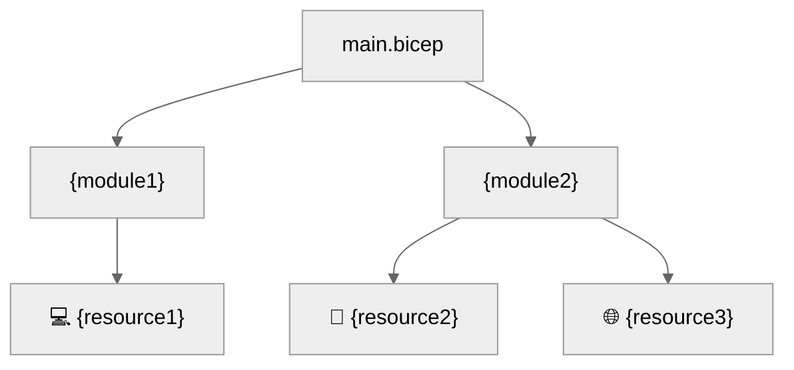

# 💻 Step 5: Implementation Reference - {project-name}


<details open>
<summary><strong>📑 Implementation Reference</strong></summary>

- [📁 IaC Templates Location](#-iac-templates-location)
- [🗂️ File Structure](#-file-structure)
- [✅ Validation Status](#-validation-status)
- [🏗️ Resources Created](#-resources-created)
- [🚀 Deployment Instructions](#-deployment-instructions)
- [📝 Key Implementation Notes](#-key-implementation-notes)

</details>

> Generated by bicep-code agent | {date}

| ⬅️ Previous                                    | 📑 Index            | Next ➡️                                              |
| ---------------------------------------------- | ------------------- | ---------------------------------------------------- |
| [04-preflight-check.md](04-preflight-check.md) | [README](README.md) | [06-deployment-summary.md](06-deployment-summary.md) |

## 📁 IaC Templates Location

📁 **Code Location**: [`infra/bicep/{project-name}/`](../../infra/bicep/{project-name}/)

## 🗂️ File Structure

```text
infra/bicep/{project-name}/
├── main.bicep              # Main orchestration template
├── main.bicepparam         # Parameter file
├── azure.yaml              # Optional consumer application manifest
└── modules/
    └── {module}.bicep      # Resource modules
```

## ✅ Validation Status

| Check         | Result       | Details                    |
| ------------- | ------------ | -------------------------- |
| `bicep build` | ✅ / ❌      | {details or error message} |
| `bicep lint`  | ✅ / ⚠️ / ❌ | {details or warning count} |
| `what-if`     | ✅ / ❌      | {resource count or error}  |

## 🏗️ Resources Created

| Resource   | Bicep Type   | Module   |
| ---------- | ------------ | -------- |
| {resource} | {bicep-type} | {module} |



> Replace with actual module and resource names from generated Bicep.

## 🚀 Deployment Instructions

<details>
<summary><strong>Kernel-Authorized Preview And Deploy</strong></summary>

```bash
apex preview --provider bicep --operation apply
# Review the exact preview and complete Gate 4 approval.
apex deploy
```

</details>


## 📝 Key Implementation Notes

| Note                                                 | Impact             | Reference     |
| ---------------------------------------------------- | ------------------ | ------------- |
| Unique suffix via `uniqueString(resourceGroup().id)` | All resource names | main.bicep    |
| {additional note}                                    | {impact area}      | {module/file} |

```bicep
var uniqueSuffix = uniqueString(resourceGroup().id)
// Example: {resource-prefix}-{suffix}
```

{additional-implementation-notes}

---

_Implementation reference generated from Bicep templates._

---

<div align="center">

| ⬅️ [04-preflight-check.md](04-preflight-check.md) | 🏠 [Project Index](README.md) | ➡️ [06-deployment-summary.md](06-deployment-summary.md) |
| ------------------------------------------------- | ----------------------------- | ------------------------------------------------------- |

</div>
