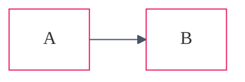

<!-- ref:mermaid-styling-v1 -->

# Mermaid Styling, Theming, and Markdown Integration

## Theming (Dark Mode Compatible)

Include a neutral theme directive for dark mode compatibility:



## Node Styling

Use `classDef` for consistent node styling:


## GitHub Markdown Integration

GitHub renders Mermaid fenced code blocks directly in supported Markdown views.
Use fenced code blocks with `mermaid` language:

````markdown

````
