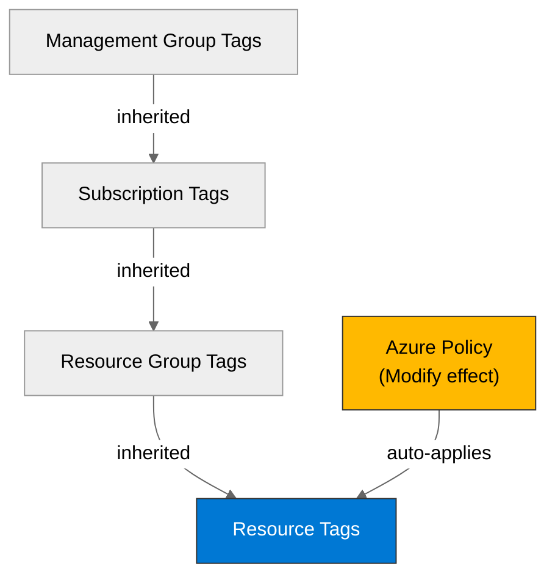

# 🛡️ Governance Constraints - vnext-qualification

<strong>📑 Governance Contents</strong>

- [🔍 Discovery Source](#-discovery-source)
- [📋 Azure Policy Compliance](#-azure-policy-compliance)
- [🔄 Plan Adaptations Based on Policies](#-plan-adaptations-based-on-policies)
- [🚫 Deployment Blockers](#-deployment-blockers)
- [🏷️ Required Tags](#-required-tags)
- [🔐 Security Policies](#-security-policies)
- [💰 Cost Policies](#-cost-policies)
- [🌐 Network Policies](#-network-policies)
- [📜 Compliance Frameworks](#-compliance-frameworks)
- [References](#references)

> Generated by 04g-Governance agent | 2026-07-20T13:44:30Z

| ⬅️ Previous                                                    | 📑 Index            | Next ➡️                                                |
| -------------------------------------------------------------- | ------------------- | ------------------------------------------------------ |
| [02-architecture-assessment.md](02-architecture-assessment.md) | [README](README.md) | [04-implementation-plan.md](04-implementation-plan.md) |

## 🔍 Discovery Source

| Query              | Results               | Timestamp            |
| ------------------ | --------------------- | -------------------- |
| Policy Assignments | 6 policies discovered | 2026-07-20T13:44:30Z |
| Tag Policies       | 0 tags required       | 2026-07-20T13:44:30Z |
| Security Policies  | 9 constraints         | 2026-07-20T13:44:30Z |

**Discovery Method**: Azure Policy REST API (discover.py)
**Subscription**: b47d2942-f5ad-4d3c-b28e-c23e4f83d97e
**Scope**: Subscription + management-group inherited

> ⚠️ **13 deployment blocker(s)** detected. Review the [Deployment Blockers](#-deployment-blockers) section before proceeding to IaC planning.

### Policy Definition Analysis

| Policy Display Name                                                                                                   | Assignment Scope                                                                      | Effect            | Classification | Category                                 | Bicep Property Path                                        | Required Value                                                                                                                                                                                                                                                                                                                                                                                                                                                                                                                                                                                                                                                                                                                                                                                                                                                                                                                                                                                                                                                                                                                                                                     |
| --------------------------------------------------------------------------------------------------------------------- | ------------------------------------------------------------------------------------- | ----------------- | -------------- | ---------------------------------------- | ---------------------------------------------------------- | ---------------------------------------------------------------------------------------------------------------------------------------------------------------------------------------------------------------------------------------------------------------------------------------------------------------------------------------------------------------------------------------------------------------------------------------------------------------------------------------------------------------------------------------------------------------------------------------------------------------------------------------------------------------------------------------------------------------------------------------------------------------------------------------------------------------------------------------------------------------------------------------------------------------------------------------------------------------------------------------------------------------------------------------------------------------------------------------------------------------------------------------------------------------------------------- |
| Block VM SKU Sizes                                                                                                    | /providers/Microsoft.Management/managementGroups/30bac921-1547-4b1e-8445-72455da783f1 | deny              | blocker        | Compute                                  |                                                            | Standard_HB120-16rs_v2, Standard_HB120-16rs_v3, Standard_HB120-32rs_v2, Standard_HB120-32rs_v3, Standard_HB120-64rs_v2, Standard_HB120-64rs_v3, Standard_HB120-96rs_v2, Standard_HB120-96rs_v3, Standard_HB120rs_v2, Standard_HB120rs_v3, Standard_HB60-15rs, Standard_HB60-30rs, Standard_HB60-45rs, Standard_HB60rs, Standard_HC44-16rs, Standard_HC44-32rs, Standard_HC44rs                                                                                                                                                                                                                                                                                                                                                                                                                                                                                                                                                                                                                                                                                                                                                                                                     |
| Block VM SKU Sizes                                                                                                    | /providers/Microsoft.Management/managementGroups/30bac921-1547-4b1e-8445-72455da783f1 | deny              | blocker        | Compute                                  |                                                            | standard_m128, standard_m128-32ms, standard_m128-64ms, standard_m128dms_v2, standard_m128ds_v2, standard_m128m, standard_m128ms, standard_m128ms_v2, standard_m128s, standard_m128s_v2, standard_m16-4ms, standard_m16-8ms, standard_m16ms, standard_m192idms_v2, standard_m192ids_v2, standard_m192ims_v2, standard_m192is_v2, standard_m208ms_v2, standard_m208s_v2, standard_m32-16ms … +24 more                                                                                                                                                                                                                                                                                                                                                                                                                                                                                                                                                                                                                                                                                                                                                                                |
| Block VM SKU Sizes                                                                                                    | /providers/Microsoft.Management/managementGroups/30bac921-1547-4b1e-8445-72455da783f1 | deny              | blocker        | Compute                                  |                                                            | standard_nc12, standard_nc12_promo, standard_nc12s_v2, standard_nc12s_v3, standard_nc16ads_a10_v4, standard_nc16as_t4_v3, standard_nc24, standard_nc24r, standard_nc24ads_a100_v4, standard_nc24_promo, standard_nc24s_v2, standard_nc24rs_v3, standard_nc24rs_v2, standard_nc24r_promo, standard_nc6, standard_nc4as_t4_v3, standard_nc48ads_a100_v4, standard_nc32ads_a10_v4, standard_nc24s_v3, standard_nc6_promo … +44 more                                                                                                                                                                                                                                                                                                                                                                                                                                                                                                                                                                                                                                                                                                                                                   |
| Deny AKS deployment with agent pool count greater than 10                                                             | /providers/Microsoft.Management/managementGroups/30bac921-1547-4b1e-8445-72455da783f1 | deny              | blocker        | Compute                                  | managedClusters::agentPoolProfiles[*]                      |                                                                                                                                                                                                                                                                                                                                                                                                                                                                                                                                                                                                                                                                                                                                                                                                                                                                                                                                                                                                                                                                                                                                                                                    |
| Deny VMSS deployment with instance count greater than 10                                                              | /providers/Microsoft.Management/managementGroups/30bac921-1547-4b1e-8445-72455da783f1 | deny              | blocker        | Compute                                  | virtualMachineScaleSets::sku.capacity                      |                                                                                                                                                                                                                                                                                                                                                                                                                                                                                                                                                                                                                                                                                                                                                                                                                                                                                                                                                                                                                                                                                                                                                                                    |
| Block Azure OpenAI Provisioned Capacity                                                                               | /providers/Microsoft.Management/managementGroups/30bac921-1547-4b1e-8445-72455da783f1 | deny              | blocker        | Cognitive Services                       | accounts/deployments::sku.name                             |                                                                                                                                                                                                                                                                                                                                                                                                                                                                                                                                                                                                                                                                                                                                                                                                                                                                                                                                                                                                                                                                                                                                                                                    |
| Block Azure Sentinel Commitment over 100                                                                              | /providers/Microsoft.Management/managementGroups/30bac921-1547-4b1e-8445-72455da783f1 | deny              | blocker        | Monitoring                               | workspaces::sku.capacityReservationLevel                   |                                                                                                                                                                                                                                                                                                                                                                                                                                                                                                                                                                                                                                                                                                                                                                                                                                                                                                                                                                                                                                                                                                                                                                                    |
| SFI-ID4.2.2 SQL DB - Safe Secrets Standard                                                                            | /providers/Microsoft.Management/managementGroups/30bac921-1547-4b1e-8445-72455da783f1 | deny              | blocker        | Uncategorized                            | sqlServers::administrators.azureADOnlyAuthentication       |                                                                                                                                                                                                                                                                                                                                                                                                                                                                                                                                                                                                                                                                                                                                                                                                                                                                                                                                                                                                                                                                                                                                                                                    |
| SFI-ID4.2.4 SQL Managed Instance - Safe Secrets Standard                                                              | /providers/Microsoft.Management/managementGroups/30bac921-1547-4b1e-8445-72455da783f1 | deny              | blocker        | Uncategorized                            | managedInstances::administrators.azureADOnlyAuthentication |                                                                                                                                                                                                                                                                                                                                                                                                                                                                                                                                                                                                                                                                                                                                                                                                                                                                                                                                                                                                                                                                                                                                                                                    |
| Not allowed resource types                                                                                            | /providers/Microsoft.Management/managementGroups/30bac921-1547-4b1e-8445-72455da783f1 | deny              | blocker        | General                                  |                                                            | microsoft.classiccompute/virtualmachines, microsoft.classiccompute/virtualmachines/diagnosticsettings, microsoft.classiccompute/virtualmachines/metricdefinitions, microsoft.classiccompute/virtualmachines/metrics, microsoft.classicnetwork/virtualnetworks, microsoft.classicnetwork/virtualnetworks/remotevirtualnetworkpeeringproxies, microsoft.classicnetwork/virtualnetworks/virtualnetworkpeerings, microsoft.classicstorage/checkstorageaccountavailability, microsoft.classicstorage/storageaccounts, microsoft.classicstorage/storageaccounts/blobservices, microsoft.classicstorage/storageaccounts/fileservices, microsoft.classicstorage/storageaccounts/metricdefinitions, microsoft.classicstorage/storageaccounts/metrics, microsoft.classicstorage/storageaccounts/queueservices, microsoft.classicstorage/storageaccounts/services, microsoft.classicstorage/storageaccounts/services/diagnosticsettings, microsoft.classicstorage/storageaccounts/services/metricdefinitions, microsoft.classicstorage/storageaccounts/services/metrics, microsoft.classicstorage/storageaccounts/tableservices, microsoft.classicstorage/storageaccounts/vmimages … +37 more |
| Deny Azure Key Vault Managed HSM with Purge Protection Enabled                                                        | /providers/Microsoft.Management/managementGroups/30bac921-1547-4b1e-8445-72455da783f1 | deny              | blocker        | Key Vault                                |                                                            | CostControl                                                                                                                                                                                                                                                                                                                                                                                                                                                                                                                                                                                                                                                                                                                                                                                                                                                                                                                                                                                                                                                                                                                                                                        |
| Configure Azure Defender for servers to be enabled                                                                    | /providers/Microsoft.Management/managementGroups/30bac921-1547-4b1e-8445-72455da783f1 | deployIfNotExists | auto-remediate | Security Center                          |                                                            |                                                                                                                                                                                                                                                                                                                                                                                                                                                                                                                                                                                                                                                                                                                                                                                                                                                                                                                                                                                                                                                                                                                                                                                    |
| Configure Microsoft Defender for Key Vault plan                                                                       | /providers/Microsoft.Management/managementGroups/30bac921-1547-4b1e-8445-72455da783f1 | deployIfNotExists | auto-remediate | Security Center                          |                                                            |                                                                                                                                                                                                                                                                                                                                                                                                                                                                                                                                                                                                                                                                                                                                                                                                                                                                                                                                                                                                                                                                                                                                                                                    |
| Configure Microsoft Defender for Azure Cosmos DB to be enabled                                                        | /providers/Microsoft.Management/managementGroups/30bac921-1547-4b1e-8445-72455da783f1 | deployIfNotExists | auto-remediate | Security Center                          |                                                            |                                                                                                                                                                                                                                                                                                                                                                                                                                                                                                                                                                                                                                                                                                                                                                                                                                                                                                                                                                                                                                                                                                                                                                                    |
| Configure Azure Defender for Azure SQL database to be enabled                                                         | /providers/Microsoft.Management/managementGroups/30bac921-1547-4b1e-8445-72455da783f1 | deployIfNotExists | auto-remediate | Security Center                          |                                                            |                                                                                                                                                                                                                                                                                                                                                                                                                                                                                                                                                                                                                                                                                                                                                                                                                                                                                                                                                                                                                                                                                                                                                                                    |
| Configure Azure Defender for SQL servers on machines to be enabled                                                    | /providers/Microsoft.Management/managementGroups/30bac921-1547-4b1e-8445-72455da783f1 | deployIfNotExists | auto-remediate | Security Center                          |                                                            |                                                                                                                                                                                                                                                                                                                                                                                                                                                                                                                                                                                                                                                                                                                                                                                                                                                                                                                                                                                                                                                                                                                                                                                    |
| Configure Azure Defender for open-source relational databases to be enabled                                           | /providers/Microsoft.Management/managementGroups/30bac921-1547-4b1e-8445-72455da783f1 | deployIfNotExists | auto-remediate | Security Center                          |                                                            |                                                                                                                                                                                                                                                                                                                                                                                                                                                                                                                                                                                                                                                                                                                                                                                                                                                                                                                                                                                                                                                                                                                                                                                    |
| Configure Microsoft Defender for Containers to be enabled                                                             | /providers/Microsoft.Management/managementGroups/30bac921-1547-4b1e-8445-72455da783f1 | deployIfNotExists | auto-remediate | Security Center                          |                                                            |                                                                                                                                                                                                                                                                                                                                                                                                                                                                                                                                                                                                                                                                                                                                                                                                                                                                                                                                                                                                                                                                                                                                                                                    |
| Configure Azure Defender for App Service to be enabled                                                                | /providers/Microsoft.Management/managementGroups/30bac921-1547-4b1e-8445-72455da783f1 | deployIfNotExists | auto-remediate | Security Center                          |                                                            |                                                                                                                                                                                                                                                                                                                                                                                                                                                                                                                                                                                                                                                                                                                                                                                                                                                                                                                                                                                                                                                                                                                                                                                    |
| Configure Azure Defender for Resource Manager to be enabled                                                           | /providers/Microsoft.Management/managementGroups/30bac921-1547-4b1e-8445-72455da783f1 | deployIfNotExists | auto-remediate | Security Center                          |                                                            |                                                                                                                                                                                                                                                                                                                                                                                                                                                                                                                                                                                                                                                                                                                                                                                                                                                                                                                                                                                                                                                                                                                                                                                    |
| Configure Microsoft Defender for Storage to be enabled                                                                | /providers/Microsoft.Management/managementGroups/30bac921-1547-4b1e-8445-72455da783f1 | deployIfNotExists | auto-remediate | Security Center                          |                                                            |                                                                                                                                                                                                                                                                                                                                                                                                                                                                                                                                                                                                                                                                                                                                                                                                                                                                                                                                                                                                                                                                                                                                                                                    |
| Configure Microsoft Defender threat protection for AI Services                                                        | /providers/Microsoft.Management/managementGroups/30bac921-1547-4b1e-8445-72455da783f1 | deployIfNotExists | auto-remediate | Security Center                          |                                                            |                                                                                                                                                                                                                                                                                                                                                                                                                                                                                                                                                                                                                                                                                                                                                                                                                                                                                                                                                                                                                                                                                                                                                                                    |
| Deploy the Windows Guest Configuration extension to enable Guest Configuration assignments on Windows VMs             | /providers/Microsoft.Management/managementGroups/30bac921-1547-4b1e-8445-72455da783f1 | deployIfNotExists | auto-remediate | Guest Configuration                      | virtualMachines::extensions/provisioningState              |                                                                                                                                                                                                                                                                                                                                                                                                                                                                                                                                                                                                                                                                                                                                                                                                                                                                                                                                                                                                                                                                                                                                                                                    |
| Add system-assigned managed identity to enable Guest Configuration assignments on virtual machines with no identities | /providers/Microsoft.Management/managementGroups/30bac921-1547-4b1e-8445-72455da783f1 | modify            | auto-remediate | Managed Identity for Guest Configuration | virtualMachines::storageProfile.osDisk.osType              | SystemAssigned                                                                                                                                                                                                                                                                                                                                                                                                                                                                                                                                                                                                                                                                                                                                                                                                                                                                                                                                                                                                                                                                                                                                                                     |
| Add system-assigned managed identity to enable Guest Configuration assignments on VMs with a user-assigned identity   | /providers/Microsoft.Management/managementGroups/30bac921-1547-4b1e-8445-72455da783f1 | modify            | auto-remediate | Managed identity for Guest Configuration | virtualMachines::storageProfile.osDisk.osType              | [concat(field('identity.type'), ',SystemAssigned')]                                                                                                                                                                                                                                                                                                                                                                                                                                                                                                                                                                                                                                                                                                                                                                                                                                                                                                                                                                                                                                                                                                                                |
| Ensure secure access to storage account containers                                                                    | /providers/Microsoft.Management/managementGroups/30bac921-1547-4b1e-8445-72455da783f1 | modify            | auto-remediate | Modify Allow Blob anonymous access       | storageAccounts::allowBlobPublicAccess                     | false                                                                                                                                                                                                                                                                                                                                                                                                                                                                                                                                                                                                                                                                                                                                                                                                                                                                                                                                                                                                                                                                                                                                                                              |
| SFI-ID4.3.2 Event Hub - Safe Secrets Standard                                                                         | /providers/Microsoft.Management/managementGroups/30bac921-1547-4b1e-8445-72455da783f1 | modify            | auto-remediate | Uncategorized                            | namespaces::disableLocalAuth                               | true                                                                                                                                                                                                                                                                                                                                                                                                                                                                                                                                                                                                                                                                                                                                                                                                                                                                                                                                                                                                                                                                                                                                                                               |
| SFI-ID4.3.3 Service Bus - Safe Secrets Standard                                                                       | /providers/Microsoft.Management/managementGroups/30bac921-1547-4b1e-8445-72455da783f1 | modify            | auto-remediate | Uncategorized                            | namespaces::disableLocalAuth                               | true                                                                                                                                                                                                                                                                                                                                                                                                                                                                                                                                                                                                                                                                                                                                                                                                                                                                                                                                                                                                                                                                                                                                                                               |
| SFI-ID4.2.1 Storage Accounts - Safe Secrets Standard                                                                  | /providers/Microsoft.Management/managementGroups/30bac921-1547-4b1e-8445-72455da783f1 | modify            | auto-remediate | Uncategorized                            | storageAccounts::allowSharedKeyAccess                      | false                                                                                                                                                                                                                                                                                                                                                                                                                                                                                                                                                                                                                                                                                                                                                                                                                                                                                                                                                                                                                                                                                                                                                                              |
| SFI-ID4.2.3 Cosmos DB - Safe Secrets Standard                                                                         | /providers/Microsoft.Management/managementGroups/30bac921-1547-4b1e-8445-72455da783f1 | modify            | auto-remediate | Uncategorized                            | databaseAccounts::disableLocalAuth                         | true                                                                                                                                                                                                                                                                                                                                                                                                                                                                                                                                                                                                                                                                                                                                                                                                                                                                                                                                                                                                                                                                                                                                                                               |
| Enable Diagnostics Settings for all Cognitive Services                                                                | /providers/Microsoft.Management/managementGroups/30bac921-1547-4b1e-8445-72455da783f1 | deployIfNotExists | auto-remediate | Uncategorized                            |                                                            |                                                                                                                                                                                                                                                                                                                                                                                                                                                                                                                                                                                                                                                                                                                                                                                                                                                                                                                                                                                                                                                                                                                                                                                    |
| Azure_AIFoundry_Audit_Enable_Diagnostic_Settings - Hubs                                                               | /providers/Microsoft.Management/managementGroups/30bac921-1547-4b1e-8445-72455da783f1 | deployIfNotExists | auto-remediate | Uncategorized                            |                                                            |                                                                                                                                                                                                                                                                                                                                                                                                                                                                                                                                                                                                                                                                                                                                                                                                                                                                                                                                                                                                                                                                                                                                                                                    |
| Azure_AIFoundry_Audit_Enable_Diagnostic_Settings - Projects                                                           | /providers/Microsoft.Management/managementGroups/30bac921-1547-4b1e-8445-72455da783f1 | deployIfNotExists | auto-remediate | Uncategorized                            |                                                            |                                                                                                                                                                                                                                                                                                                                                                                                                                                                                                                                                                                                                                                                                                                                                                                                                                                                                                                                                                                                                                                                                                                                                                                    |
| Disable Local auth for all Cognitive Services                                                                         | /providers/Microsoft.Management/managementGroups/30bac921-1547-4b1e-8445-72455da783f1 | modify            | auto-remediate | Uncategorized                            | accounts::disableLocalAuth                                 | true                                                                                                                                                                                                                                                                                                                                                                                                                                                                                                                                                                                                                                                                                                                                                                                                                                                                                                                                                                                                                                                                                                                                                                               |
| Deploy Resource Group McapsGovernance                                                                                 | /providers/Microsoft.Management/managementGroups/30bac921-1547-4b1e-8445-72455da783f1 | deployIfNotExists | auto-remediate | Uncategorized                            |                                                            |                                                                                                                                                                                                                                                                                                                                                                                                                                                                                                                                                                                                                                                                                                                                                                                                                                                                                                                                                                                                                                                                                                                                                                                    |
| Deploy Storage Account for Diagnostic Settings                                                                        | /providers/Microsoft.Management/managementGroups/30bac921-1547-4b1e-8445-72455da783f1 | deployIfNotExists | auto-remediate | Uncategorized                            |                                                            |                                                                                                                                                                                                                                                                                                                                                                                                                                                                                                                                                                                                                                                                                                                                                                                                                                                                                                                                                                                                                                                                                                                                                                                    |
| AIFoundryHub_PublicNetwork_Modify                                                                                     | /providers/Microsoft.Management/managementGroups/30bac921-1547-4b1e-8445-72455da783f1 | modify            | auto-remediate | Uncategorized                            | workspaces::publicNetworkAccess                            | Disabled                                                                                                                                                                                                                                                                                                                                                                                                                                                                                                                                                                                                                                                                                                                                                                                                                                                                                                                                                                                                                                                                                                                                                                           |
| SFI - Disable public network access on Storage accounts (excluding NSP configured resources)                          | /providers/Microsoft.Management/managementGroups/30bac921-1547-4b1e-8445-72455da783f1 | modify            | auto-remediate | Network                                  | storageAccounts::publicNetworkAccess                       | Disabled                                                                                                                                                                                                                                                                                                                                                                                                                                                                                                                                                                                                                                                                                                                                                                                                                                                                                                                                                                                                                                                                                                                                                                           |
| SFI - Disable public network access on Key Vaults (excluding NSP configured resources)                                | /providers/Microsoft.Management/managementGroups/30bac921-1547-4b1e-8445-72455da783f1 | modify            | auto-remediate | Network                                  | keyVaults::publicNetworkAccess                             | Disabled                                                                                                                                                                                                                                                                                                                                                                                                                                                                                                                                                                                                                                                                                                                                                                                                                                                                                                                                                                                                                                                                                                                                                                           |
| SFI - Disable public network access on Cosmos DB accounts (excluding NSP configured resources)                        | /providers/Microsoft.Management/managementGroups/30bac921-1547-4b1e-8445-72455da783f1 | modify            | auto-remediate | Network                                  | databaseAccounts::publicNetworkAccess                      | Disabled                                                                                                                                                                                                                                                                                                                                                                                                                                                                                                                                                                                                                                                                                                                                                                                                                                                                                                                                                                                                                                                                                                                                                                           |
| SFI - Disable public network access on SQL DB servers (excluding NSP configured resources)                            | /providers/Microsoft.Management/managementGroups/30bac921-1547-4b1e-8445-72455da783f1 | modify            | auto-remediate | Network                                  | sqlServers::publicNetworkAccess                            | Disabled                                                                                                                                                                                                                                                                                                                                                                                                                                                                                                                                                                                                                                                                                                                                                                                                                                                                                                                                                                                                                                                                                                                                                                           |
| Configure Microsoft Defender CSPM plan                                                                                | /providers/Microsoft.Management/managementGroups/30bac921-1547-4b1e-8445-72455da783f1 | deployIfNotExists | auto-remediate | Uncategorized                            |                                                            |                                                                                                                                                                                                                                                                                                                                                                                                                                                                                                                                                                                                                                                                                                                                                                                                                                                                                                                                                                                                                                                                                                                                                                                    |
| Configure Node OS Auto upgrade on Azure Kubernetes Cluster                                                            | /providers/Microsoft.Management/managementGroups/30bac921-1547-4b1e-8445-72455da783f1 | deployIfNotExists | auto-remediate | Uncategorized                            | managedClusters::autoUpgradeProfile.nodeOSUpgradeChannel   |                                                                                                                                                                                                                                                                                                                                                                                                                                                                                                                                                                                                                                                                                                                                                                                                                                                                                                                                                                                                                                                                                                                                                                                    |
| Block Azure RM Resource Creation                                                                                      | /providers/Microsoft.Management/managementGroups/30bac921-1547-4b1e-8445-72455da783f1 | deny              | blocker        | Uncategorized                            |                                                            |                                                                                                                                                                                                                                                                                                                                                                                                                                                                                                                                                                                                                                                                                                                                                                                                                                                                                                                                                                                                                                                                                                                                                                                    |
| Resources should not be created in West Europe                                                                        | /providers/Microsoft.Management/managementGroups/30bac921-1547-4b1e-8445-72455da783f1 | deny              | blocker        | System Policy                            |                                                            |                                                                                                                                                                                                                                                                                                                                                                                                                                                                                                                                                                                                                                                                                                                                                                                                                                                                                                                                                                                                                                                                                                                                                                                    |

## 📋 Azure Policy Compliance

> **Note**: No architecture assessment provided. IaC impact annotations will be populated during Step 4 (IaC Planning).

| Category                                 | Constraint                                                                                                            | Implementation                          | Status |
| ---------------------------------------- | --------------------------------------------------------------------------------------------------------------------- | --------------------------------------- | ------ |
| Cognitive Services                       | Block Azure OpenAI Provisioned Capacity                                                                               | Blocked — must comply before deployment | ❌     |
| Compute                                  | Block VM SKU Sizes                                                                                                    | Blocked — must comply before deployment | ❌     |
| Compute                                  | Block VM SKU Sizes                                                                                                    | Blocked — must comply before deployment | ❌     |
| Compute                                  | Block VM SKU Sizes                                                                                                    | Blocked — must comply before deployment | ❌     |
| Compute                                  | Deny AKS deployment with agent pool count greater than 10                                                             | Blocked — must comply before deployment | ❌     |
| Compute                                  | Deny VMSS deployment with instance count greater than 10                                                              | Blocked — must comply before deployment | ❌     |
| General                                  | Not allowed resource types                                                                                            | Blocked — must comply before deployment | ❌     |
| Guest Configuration                      | Deploy the Windows Guest Configuration extension to enable Guest Configuration assignments on Windows VMs             | Auto-applied by Azure Policy            | ✅     |
| Key Vault                                | Deny Azure Key Vault Managed HSM with Purge Protection Enabled                                                        | Blocked — must comply before deployment | ❌     |
| Managed Identity for Guest Configuration | Add system-assigned managed identity to enable Guest Configuration assignments on virtual machines with no identities | Auto-applied by Azure Policy            | ✅     |
| Managed identity for Guest Configuration | Add system-assigned managed identity to enable Guest Configuration assignments on VMs with a user-assigned identity   | Auto-applied by Azure Policy            | ✅     |
| Modify Allow Blob anonymous access       | Ensure secure access to storage account containers                                                                    | Auto-applied by Azure Policy            | ✅     |
| Monitoring                               | Block Azure Sentinel Commitment over 100                                                                              | Blocked — must comply before deployment | ❌     |
| Network                                  | SFI - Disable public network access on Storage accounts (excluding NSP configured resources)                          | Auto-applied by Azure Policy            | ✅     |
| Network                                  | SFI - Disable public network access on Key Vaults (excluding NSP configured resources)                                | Auto-applied by Azure Policy            | ✅     |
| Network                                  | SFI - Disable public network access on Cosmos DB accounts (excluding NSP configured resources)                        | Auto-applied by Azure Policy            | ✅     |
| Network                                  | SFI - Disable public network access on SQL DB servers (excluding NSP configured resources)                            | Auto-applied by Azure Policy            | ✅     |
| Security Center                          | Configure Azure Defender for servers to be enabled                                                                    | Auto-applied by Azure Policy            | ✅     |
| Security Center                          | Configure Microsoft Defender for Key Vault plan                                                                       | Auto-applied by Azure Policy            | ✅     |
| Security Center                          | Configure Microsoft Defender for Azure Cosmos DB to be enabled                                                        | Auto-applied by Azure Policy            | ✅     |
| Security Center                          | Configure Azure Defender for Azure SQL database to be enabled                                                         | Auto-applied by Azure Policy            | ✅     |
| Security Center                          | Configure Azure Defender for SQL servers on machines to be enabled                                                    | Auto-applied by Azure Policy            | ✅     |
| Security Center                          | Configure Azure Defender for open-source relational databases to be enabled                                           | Auto-applied by Azure Policy            | ✅     |
| Security Center                          | Configure Microsoft Defender for Containers to be enabled                                                             | Auto-applied by Azure Policy            | ✅     |
| Security Center                          | Configure Azure Defender for App Service to be enabled                                                                | Auto-applied by Azure Policy            | ✅     |
| Security Center                          | Configure Azure Defender for Resource Manager to be enabled                                                           | Auto-applied by Azure Policy            | ✅     |
| Security Center                          | Configure Microsoft Defender for Storage to be enabled                                                                | Auto-applied by Azure Policy            | ✅     |
| Security Center                          | Configure Microsoft Defender threat protection for AI Services                                                        | Auto-applied by Azure Policy            | ✅     |
| System Policy                            | Resources should not be created in West Europe                                                                        | Blocked — must comply before deployment | ❌     |
| Uncategorized                            | SFI-ID4.2.2 SQL DB - Safe Secrets Standard                                                                            | Blocked — must comply before deployment | ❌     |
| Uncategorized                            | SFI-ID4.2.4 SQL Managed Instance - Safe Secrets Standard                                                              | Blocked — must comply before deployment | ❌     |
| Uncategorized                            | SFI-ID4.3.2 Event Hub - Safe Secrets Standard                                                                         | Auto-applied by Azure Policy            | ✅     |
| Uncategorized                            | SFI-ID4.3.3 Service Bus - Safe Secrets Standard                                                                       | Auto-applied by Azure Policy            | ✅     |
| Uncategorized                            | SFI-ID4.2.1 Storage Accounts - Safe Secrets Standard                                                                  | Auto-applied by Azure Policy            | ✅     |
| Uncategorized                            | SFI-ID4.2.3 Cosmos DB - Safe Secrets Standard                                                                         | Auto-applied by Azure Policy            | ✅     |
| Uncategorized                            | Enable Diagnostics Settings for all Cognitive Services                                                                | Auto-applied by Azure Policy            | ✅     |
| Uncategorized                            | Azure_AIFoundry_Audit_Enable_Diagnostic_Settings - Hubs                                                               | Auto-applied by Azure Policy            | ✅     |
| Uncategorized                            | Azure_AIFoundry_Audit_Enable_Diagnostic_Settings - Projects                                                           | Auto-applied by Azure Policy            | ✅     |
| Uncategorized                            | Disable Local auth for all Cognitive Services                                                                         | Auto-applied by Azure Policy            | ✅     |
| Uncategorized                            | Deploy Resource Group McapsGovernance                                                                                 | Auto-applied by Azure Policy            | ✅     |
| Uncategorized                            | Deploy Storage Account for Diagnostic Settings                                                                        | Auto-applied by Azure Policy            | ✅     |
| Uncategorized                            | AIFoundryHub_PublicNetwork_Modify                                                                                     | Auto-applied by Azure Policy            | ✅     |
| Uncategorized                            | Configure Microsoft Defender CSPM plan                                                                                | Auto-applied by Azure Policy            | ✅     |
| Uncategorized                            | Configure Node OS Auto upgrade on Azure Kubernetes Cluster                                                            | Auto-applied by Azure Policy            | ✅     |
| Uncategorized                            | Block Azure RM Resource Creation                                                                                      | Blocked — must comply before deployment | ❌     |

## 🔄 Plan Adaptations Based on Policies

### Architectural Changes

| Original Design        | Blocking Policy                                                | Effect | Adaptation Applied            |
| ---------------------- | -------------------------------------------------------------- | ------ | ----------------------------- |
| No architecture target | Block VM SKU Sizes                                             | deny   | Review at Step 4 IaC Planning |
| No architecture target | Block VM SKU Sizes                                             | deny   | Review at Step 4 IaC Planning |
| No architecture target | Block VM SKU Sizes                                             | deny   | Review at Step 4 IaC Planning |
| No architecture target | Deny AKS deployment with agent pool count greater than 10      | deny   | Review at Step 4 IaC Planning |
| No architecture target | Deny VMSS deployment with instance count greater than 10       | deny   | Review at Step 4 IaC Planning |
| No architecture target | Block Azure OpenAI Provisioned Capacity                        | deny   | Review at Step 4 IaC Planning |
| No architecture target | Block Azure Sentinel Commitment over 100                       | deny   | Review at Step 4 IaC Planning |
| No architecture target | SFI-ID4.2.2 SQL DB - Safe Secrets Standard                     | deny   | Review at Step 4 IaC Planning |
| No architecture target | SFI-ID4.2.4 SQL Managed Instance - Safe Secrets Standard       | deny   | Review at Step 4 IaC Planning |
| No architecture target | Not allowed resource types                                     | deny   | Review at Step 4 IaC Planning |
| No architecture target | Deny Azure Key Vault Managed HSM with Purge Protection Enabled | deny   | Review at Step 4 IaC Planning |
| No architecture target | Block Azure RM Resource Creation                               | deny   | Review at Step 4 IaC Planning |
| No architecture target | Resources should not be created in West Europe                 | deny   | Review at Step 4 IaC Planning |

### Auto-Applied Resources

| Policy                                                                                                    | Effect            | Auto-Applied Resource         |
| --------------------------------------------------------------------------------------------------------- | ----------------- | ----------------------------- |
| Configure Azure Defender for servers to be enabled                                                        | DeployIfNotExists | Auto-deployed by Azure Policy |
| Configure Microsoft Defender for Key Vault plan                                                           | DeployIfNotExists | Auto-deployed by Azure Policy |
| Configure Microsoft Defender for Azure Cosmos DB to be enabled                                            | DeployIfNotExists | Auto-deployed by Azure Policy |
| Configure Azure Defender for Azure SQL database to be enabled                                             | DeployIfNotExists | Auto-deployed by Azure Policy |
| Configure Azure Defender for SQL servers on machines to be enabled                                        | DeployIfNotExists | Auto-deployed by Azure Policy |
| Configure Azure Defender for open-source relational databases to be enabled                               | DeployIfNotExists | Auto-deployed by Azure Policy |
| Configure Microsoft Defender for Containers to be enabled                                                 | DeployIfNotExists | Auto-deployed by Azure Policy |
| Configure Azure Defender for App Service to be enabled                                                    | DeployIfNotExists | Auto-deployed by Azure Policy |
| Configure Azure Defender for Resource Manager to be enabled                                               | DeployIfNotExists | Auto-deployed by Azure Policy |
| Configure Microsoft Defender for Storage to be enabled                                                    | DeployIfNotExists | Auto-deployed by Azure Policy |
| Configure Microsoft Defender threat protection for AI Services                                            | DeployIfNotExists | Auto-deployed by Azure Policy |
| Deploy the Windows Guest Configuration extension to enable Guest Configuration assignments on Windows VMs | DeployIfNotExists | Auto-deployed by Azure Policy |
| Enable Diagnostics Settings for all Cognitive Services                                                    | DeployIfNotExists | Auto-deployed by Azure Policy |
| Azure_AIFoundry_Audit_Enable_Diagnostic_Settings - Hubs                                                   | DeployIfNotExists | Auto-deployed by Azure Policy |
| Azure_AIFoundry_Audit_Enable_Diagnostic_Settings - Projects                                               | DeployIfNotExists | Auto-deployed by Azure Policy |
| Deploy Resource Group McapsGovernance                                                                     | DeployIfNotExists | Auto-deployed by Azure Policy |
| Deploy Storage Account for Diagnostic Settings                                                            | DeployIfNotExists | Auto-deployed by Azure Policy |
| Configure Microsoft Defender CSPM plan                                                                    | DeployIfNotExists | Auto-deployed by Azure Policy |
| Configure Node OS Auto upgrade on Azure Kubernetes Cluster                                                | DeployIfNotExists | Auto-deployed by Azure Policy |

### Auto-Modified Configurations

| Policy                                                                                                                | Effect | Auto-Applied Change           |
| --------------------------------------------------------------------------------------------------------------------- | ------ | ----------------------------- |
| Add system-assigned managed identity to enable Guest Configuration assignments on virtual machines with no identities | Modify | Auto-modified by Azure Policy |
| Add system-assigned managed identity to enable Guest Configuration assignments on VMs with a user-assigned identity   | Modify | Auto-modified by Azure Policy |
| Ensure secure access to storage account containers                                                                    | Modify | Auto-modified by Azure Policy |
| SFI-ID4.3.2 Event Hub - Safe Secrets Standard                                                                         | Modify | Auto-modified by Azure Policy |
| SFI-ID4.3.3 Service Bus - Safe Secrets Standard                                                                       | Modify | Auto-modified by Azure Policy |
| SFI-ID4.2.1 Storage Accounts - Safe Secrets Standard                                                                  | Modify | Auto-modified by Azure Policy |
| SFI-ID4.2.3 Cosmos DB - Safe Secrets Standard                                                                         | Modify | Auto-modified by Azure Policy |
| Disable Local auth for all Cognitive Services                                                                         | Modify | Auto-modified by Azure Policy |
| AIFoundryHub_PublicNetwork_Modify                                                                                     | Modify | Auto-modified by Azure Policy |
| SFI - Disable public network access on Storage accounts (excluding NSP configured resources)                          | Modify | Auto-modified by Azure Policy |
| SFI - Disable public network access on Key Vaults (excluding NSP configured resources)                                | Modify | Auto-modified by Azure Policy |
| SFI - Disable public network access on Cosmos DB accounts (excluding NSP configured resources)                        | Modify | Auto-modified by Azure Policy |
| SFI - Disable public network access on SQL DB servers (excluding NSP configured resources)                            | Modify | Auto-modified by Azure Policy |

## 🚫 Deployment Blockers

> **13** blocker finding(s) from **13** unique policies (duplicates from multi-scope inheritance are consolidated below).

### Block VM SKU Sizes

- **Policy ID**: `/providers/Microsoft.Management/managementGroups/30bac921-1547-4b1e-8445-72455da783f1/providers/Microsoft.Authorization/policyDefinitions/VirtualMachine_SKU_Deny`
- **Effect**: deny
- **Scope**: /providers/Microsoft.Management/managementGroups/30bac921-1547-4b1e-8445-72455da783f1
- **Category**: Compute
- **Bicep Property Path**: ``
- **Required Value**: Standard_HB120-16rs_v2, Standard_HB120-16rs_v3, Standard_HB120-32rs_v2, Standard_HB120-32rs_v3, Standard_HB120-64rs_v2, Standard_HB120-64rs_v3, Standard_HB120-96rs_v2, Standard_HB120-96rs_v3, Standard_HB120rs_v2, Standard_HB120rs_v3, Standard_HB60-15rs, Standard_HB60-30rs, Standard_HB60-45rs, Standard_HB60rs, Standard_HC44-16rs, Standard_HC44-32rs, Standard_HC44rs

> **Resolution**: Review during Step 4 IaC Planning — apply an exemption, use an allowed alternative, or update the policy scope.

### Block VM SKU Sizes

- **Policy ID**: `/providers/Microsoft.Management/managementGroups/30bac921-1547-4b1e-8445-72455da783f1/providers/Microsoft.Authorization/policyDefinitions/VirtualMachine_SKU_Deny`
- **Effect**: deny
- **Scope**: /providers/Microsoft.Management/managementGroups/30bac921-1547-4b1e-8445-72455da783f1
- **Category**: Compute
- **Bicep Property Path**: ``
- **Required Value**: standard_m128, standard_m128-32ms, standard_m128-64ms, standard_m128dms_v2, standard_m128ds_v2, standard_m128m, standard_m128ms, standard_m128ms_v2, standard_m128s, standard_m128s_v2, standard_m16-4ms, standard_m16-8ms, standard_m16ms, standard_m192idms_v2, standard_m192ids_v2, standard_m192ims_v2, standard_m192is_v2, standard_m208ms_v2, standard_m208s_v2, standard_m32-16ms … +24 more

> **Resolution**: Review during Step 4 IaC Planning — apply an exemption, use an allowed alternative, or update the policy scope.

### Block VM SKU Sizes

- **Policy ID**: `/providers/Microsoft.Management/managementGroups/30bac921-1547-4b1e-8445-72455da783f1/providers/Microsoft.Authorization/policyDefinitions/VirtualMachine_SKU_Deny`
- **Effect**: deny
- **Scope**: /providers/Microsoft.Management/managementGroups/30bac921-1547-4b1e-8445-72455da783f1
- **Category**: Compute
- **Bicep Property Path**: ``
- **Required Value**: standard_nc12, standard_nc12_promo, standard_nc12s_v2, standard_nc12s_v3, standard_nc16ads_a10_v4, standard_nc16as_t4_v3, standard_nc24, standard_nc24r, standard_nc24ads_a100_v4, standard_nc24_promo, standard_nc24s_v2, standard_nc24rs_v3, standard_nc24rs_v2, standard_nc24r_promo, standard_nc6, standard_nc4as_t4_v3, standard_nc48ads_a100_v4, standard_nc32ads_a10_v4, standard_nc24s_v3, standard_nc6_promo … +44 more

> **Resolution**: Review during Step 4 IaC Planning — apply an exemption, use an allowed alternative, or update the policy scope.

### Deny AKS deployment with agent pool count greater than 10

- **Policy ID**: `/providers/Microsoft.Management/managementGroups/30bac921-1547-4b1e-8445-72455da783f1/providers/Microsoft.Authorization/policyDefinitions/AKS_LimitNodeCount_Deny`
- **Effect**: deny
- **Scope**: /providers/Microsoft.Management/managementGroups/30bac921-1547-4b1e-8445-72455da783f1
- **Category**: Compute
- **Bicep Property Path**: `managedClusters::agentPoolProfiles[*]`
- **Required Value**: N/A — parameter values not available in cached baseline; run `--refresh` for live lookup

> **Resolution**: Review during Step 4 IaC Planning — apply an exemption, use an allowed alternative, or update the policy scope.

### Deny VMSS deployment with instance count greater than 10

- **Policy ID**: `/providers/Microsoft.Management/managementGroups/30bac921-1547-4b1e-8445-72455da783f1/providers/Microsoft.Authorization/policyDefinitions/VMSS_LimitNodesCount_Deny`
- **Effect**: deny
- **Scope**: /providers/Microsoft.Management/managementGroups/30bac921-1547-4b1e-8445-72455da783f1
- **Category**: Compute
- **Bicep Property Path**: `virtualMachineScaleSets::sku.capacity`
- **Required Value**: N/A — parameter values not available in cached baseline; run `--refresh` for live lookup

> **Resolution**: Review during Step 4 IaC Planning — apply an exemption, use an allowed alternative, or update the policy scope.

### Block Azure OpenAI Provisioned Capacity

- **Policy ID**: `/providers/Microsoft.Management/managementGroups/30bac921-1547-4b1e-8445-72455da783f1/providers/Microsoft.Authorization/policyDefinitions/AzureOpenAI_ProvisionedCapacity_Deny`
- **Effect**: deny
- **Scope**: /providers/Microsoft.Management/managementGroups/30bac921-1547-4b1e-8445-72455da783f1
- **Category**: Cognitive Services
- **Bicep Property Path**: `accounts/deployments::sku.name`
- **Required Value**: N/A — parameter values not available in cached baseline; run `--refresh` for live lookup

> **Resolution**: Review during Step 4 IaC Planning — apply an exemption, use an allowed alternative, or update the policy scope.

### Block Azure Sentinel Commitment over 100

- **Policy ID**: `/providers/Microsoft.Management/managementGroups/30bac921-1547-4b1e-8445-72455da783f1/providers/Microsoft.Authorization/policyDefinitions/Sentinel_Commitment_Deny`
- **Effect**: deny
- **Scope**: /providers/Microsoft.Management/managementGroups/30bac921-1547-4b1e-8445-72455da783f1
- **Category**: Monitoring
- **Bicep Property Path**: `workspaces::sku.capacityReservationLevel`
- **Required Value**: N/A — parameter values not available in cached baseline; run `--refresh` for live lookup

> **Resolution**: Review during Step 4 IaC Planning — apply an exemption, use an allowed alternative, or update the policy scope.

### SFI-ID4.2.2 SQL DB - Safe Secrets Standard

- **Policy ID**: `/providers/Microsoft.Management/managementGroups/30bac921-1547-4b1e-8445-72455da783f1/providers/Microsoft.Authorization/policyDefinitions/AzureSQL_WithoutAzureADOnlyAuthentication_Deny`
- **Effect**: deny
- **Scope**: /providers/Microsoft.Management/managementGroups/30bac921-1547-4b1e-8445-72455da783f1
- **Category**: Uncategorized
- **Bicep Property Path**: `sqlServers::administrators.azureADOnlyAuthentication`
- **Required Value**: N/A — parameter values not available in cached baseline; run `--refresh` for live lookup

> **Resolution**: Review during Step 4 IaC Planning — apply an exemption, use an allowed alternative, or update the policy scope.

### SFI-ID4.2.4 SQL Managed Instance - Safe Secrets Standard

- **Policy ID**: `/providers/Microsoft.Management/managementGroups/30bac921-1547-4b1e-8445-72455da783f1/providers/Microsoft.Authorization/policyDefinitions/AzureSQLMI_WithoutAzureADOnlyAuthentication_Deny`
- **Effect**: deny
- **Scope**: /providers/Microsoft.Management/managementGroups/30bac921-1547-4b1e-8445-72455da783f1
- **Category**: Uncategorized
- **Bicep Property Path**: `managedInstances::administrators.azureADOnlyAuthentication`
- **Required Value**: N/A — parameter values not available in cached baseline; run `--refresh` for live lookup

> **Resolution**: Review during Step 4 IaC Planning — apply an exemption, use an allowed alternative, or update the policy scope.

### Not allowed resource types

- **Policy ID**: `/providers/Microsoft.Authorization/policyDefinitions/6c112d4e-5bc7-47ae-a041-ea2d9dccd749`
- **Effect**: deny
- **Scope**: /providers/Microsoft.Management/managementGroups/30bac921-1547-4b1e-8445-72455da783f1
- **Category**: General
- **Bicep Property Path**: ``
- **Required Value**: microsoft.classiccompute/virtualmachines, microsoft.classiccompute/virtualmachines/diagnosticsettings, microsoft.classiccompute/virtualmachines/metricdefinitions, microsoft.classiccompute/virtualmachines/metrics, microsoft.classicnetwork/virtualnetworks, microsoft.classicnetwork/virtualnetworks/remotevirtualnetworkpeeringproxies, microsoft.classicnetwork/virtualnetworks/virtualnetworkpeerings, microsoft.classicstorage/checkstorageaccountavailability, microsoft.classicstorage/storageaccounts, microsoft.classicstorage/storageaccounts/blobservices, microsoft.classicstorage/storageaccounts/fileservices, microsoft.classicstorage/storageaccounts/metricdefinitions, microsoft.classicstorage/storageaccounts/metrics, microsoft.classicstorage/storageaccounts/queueservices, microsoft.classicstorage/storageaccounts/services, microsoft.classicstorage/storageaccounts/services/diagnosticsettings, microsoft.classicstorage/storageaccounts/services/metricdefinitions, microsoft.classicstorage/storageaccounts/services/metrics, microsoft.classicstorage/storageaccounts/tableservices, microsoft.classicstorage/storageaccounts/vmimages … +37 more

> **Resolution**: Review during Step 4 IaC Planning — apply an exemption, use an allowed alternative, or update the policy scope.

### Deny Azure Key Vault Managed HSM with Purge Protection Enabled

- **Policy ID**: `/providers/Microsoft.Management/managementGroups/30bac921-1547-4b1e-8445-72455da783f1/providers/Microsoft.Authorization/policyDefinitions/KeyVaultManagedHSM_PurgeProtectionEnabled_Deny`
- **Effect**: deny
- **Scope**: /providers/Microsoft.Management/managementGroups/30bac921-1547-4b1e-8445-72455da783f1
- **Category**: Key Vault
- **Bicep Property Path**: ``
- **Required Value**: CostControl

> **Resolution**: Review during Step 4 IaC Planning — apply an exemption, use an allowed alternative, or update the policy scope.

### Block Azure RM Resource Creation

- **Policy ID**: `/providers/Microsoft.Management/managementGroups/30bac921-1547-4b1e-8445-72455da783f1/providers/Microsoft.Authorization/policyDefinitions/a15944e7-86a5-4adf-a36c-d851916c9001`
- **Effect**: deny
- **Scope**: /providers/Microsoft.Management/managementGroups/30bac921-1547-4b1e-8445-72455da783f1
- **Category**: Uncategorized
- **Bicep Property Path**: ``
- **Required Value**: N/A — parameter values not available in cached baseline; run `--refresh` for live lookup

> **Resolution**: Review during Step 4 IaC Planning — apply an exemption, use an allowed alternative, or update the policy scope.

### Resources should not be created in West Europe

- **Policy ID**: `/providers/Microsoft.Authorization/policyDefinitions/7509877f-d414-4d79-8d1f-d600ea78d087`
- **Effect**: deny
- **Scope**: /providers/Microsoft.Management/managementGroups/30bac921-1547-4b1e-8445-72455da783f1
- **Category**: System Policy
- **Bicep Property Path**: ``
- **Required Value**: N/A — parameter values not available in cached baseline; run `--refresh` for live lookup

> **Resolution**: Review during Step 4 IaC Planning — apply an exemption, use an allowed alternative, or update the policy scope.

## 🏷️ Required Tags

No tag-enforcement policies discovered.

## 🔐 Security Policies

| Policy                                                                                 | Effect            | Status |
| -------------------------------------------------------------------------------------- | ----------------- | ------ |
| SFI-ID4.2.2 SQL DB - Safe Secrets Standard                                             | deny              | ❌     |
| SFI-ID4.2.4 SQL Managed Instance - Safe Secrets Standard                               | deny              | ❌     |
| Deny Azure Key Vault Managed HSM with Purge Protection Enabled                         | deny              | ❌     |
| Configure Microsoft Defender for Key Vault plan                                        | deployIfNotExists | ✅     |
| SFI-ID4.3.2 Event Hub - Safe Secrets Standard                                          | modify            | ✅     |
| SFI-ID4.3.3 Service Bus - Safe Secrets Standard                                        | modify            | ✅     |
| SFI-ID4.2.1 Storage Accounts - Safe Secrets Standard                                   | modify            | ✅     |
| SFI-ID4.2.3 Cosmos DB - Safe Secrets Standard                                          | modify            | ✅     |
| SFI - Disable public network access on Key Vaults (excluding NSP configured resources) | modify            | ✅     |

## 💰 Cost Policies

| Policy                                                    | Effect | Constraint                                                                                                                                                                                                                                                                                                                                                                                                                       |
| --------------------------------------------------------- | ------ | -------------------------------------------------------------------------------------------------------------------------------------------------------------------------------------------------------------------------------------------------------------------------------------------------------------------------------------------------------------------------------------------------------------------------------- |
| Block VM SKU Sizes                                        | deny   | Standard_HB120-16rs_v2, Standard_HB120-16rs_v3, Standard_HB120-32rs_v2, Standard_HB120-32rs_v3, Standard_HB120-64rs_v2, Standard_HB120-64rs_v3, Standard_HB120-96rs_v2, Standard_HB120-96rs_v3, Standard_HB120rs_v2, Standard_HB120rs_v3, Standard_HB60-15rs, Standard_HB60-30rs, Standard_HB60-45rs, Standard_HB60rs, Standard_HC44-16rs, Standard_HC44-32rs, Standard_HC44rs                                                   |
| Block VM SKU Sizes                                        | deny   | standard_m128, standard_m128-32ms, standard_m128-64ms, standard_m128dms_v2, standard_m128ds_v2, standard_m128m, standard_m128ms, standard_m128ms_v2, standard_m128s, standard_m128s_v2, standard_m16-4ms, standard_m16-8ms, standard_m16ms, standard_m192idms_v2, standard_m192ids_v2, standard_m192ims_v2, standard_m192is_v2, standard_m208ms_v2, standard_m208s_v2, standard_m32-16ms … +24 more                              |
| Block VM SKU Sizes                                        | deny   | standard_nc12, standard_nc12_promo, standard_nc12s_v2, standard_nc12s_v3, standard_nc16ads_a10_v4, standard_nc16as_t4_v3, standard_nc24, standard_nc24r, standard_nc24ads_a100_v4, standard_nc24_promo, standard_nc24s_v2, standard_nc24rs_v3, standard_nc24rs_v2, standard_nc24r_promo, standard_nc6, standard_nc4as_t4_v3, standard_nc48ads_a100_v4, standard_nc32ads_a10_v4, standard_nc24s_v3, standard_nc6_promo … +44 more |
| Deny AKS deployment with agent pool count greater than 10 | deny   | See policy parameters                                                                                                                                                                                                                                                                                                                                                                                                            |
| Deny VMSS deployment with instance count greater than 10  | deny   | See policy parameters                                                                                                                                                                                                                                                                                                                                                                                                            |
| Block Azure OpenAI Provisioned Capacity                   | deny   | See policy parameters                                                                                                                                                                                                                                                                                                                                                                                                            |
| Block Azure Sentinel Commitment over 100                  | deny   | See policy parameters                                                                                                                                                                                                                                                                                                                                                                                                            |

## 🌐 Network Policies

| Policy                                                                                         | Effect | Constraint |
| ---------------------------------------------------------------------------------------------- | ------ | ---------- |
| SFI - Disable public network access on Storage accounts (excluding NSP configured resources)   | modify | Disabled   |
| SFI - Disable public network access on Key Vaults (excluding NSP configured resources)         | modify | Disabled   |
| SFI - Disable public network access on Cosmos DB accounts (excluding NSP configured resources) | modify | Disabled   |
| SFI - Disable public network access on SQL DB servers (excluding NSP configured resources)     | modify | Disabled   |

### Approved Security Exception

The maintainer authorized `vnext-qualification-backend-entra-session` for the 24-hour window from
`2026-07-20T13:43:47Z` through `2026-07-21T13:43:47Z`. This repository record does not itself change Azure networking.
Runtime validation requires at least 75 minutes remaining before each session mutation.

- **Control:** Authenticated public network session
- **Scope:** `vnext-qualification` / `encrypted-handoff-backend`
- **Authorization:** Entra RBAC only; shared keys and anonymous Blob access remain disabled
- **At rest:** Public network access `Disabled`, firewall default action `Deny`, and no IP rules
- **Session marker:** `SecurityControl=Ignore`, transaction-only
- **Cleanup:** Restore `Deny`, disable public access, remove the marker, and verify final state
- **Audit:** [Issue #13](https://github.com/jonathan-vella/apex-vnext/issues/13)

## 📜 Compliance Frameworks

> These audit/compliance assignments are active at subscription or management-group scope.
> While they do not block deployments (audit effect), they may impose architecture constraints
> (data residency, encryption, access logging, network segmentation).

| Assignment              | Scope                                                                                 | Type             |
| ----------------------- | ------------------------------------------------------------------------------------- | ---------------- |
| Azure Security Baseline | /providers/Microsoft.Management/managementGroups/30bac921-1547-4b1e-8445-72455da783f1 | management-group |

## References

| Topic          | Link                                                                                                                       |
| -------------- | -------------------------------------------------------------------------------------------------------------------------- |
| Azure Policy   | [Overview](https://learn.microsoft.com/azure/governance/policy/overview)                                                   |
| Tag Governance | [Tagging Strategy](https://learn.microsoft.com/azure/cloud-adoption-framework/ready/azure-best-practices/resource-tagging) |

---

_Governance constraints discovered from Azure Policy REST API via discover.py._
