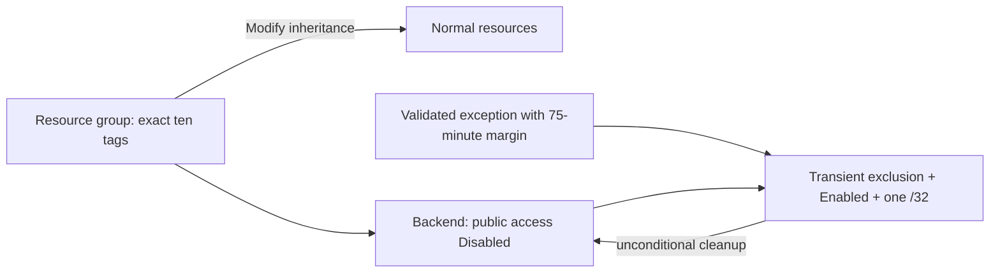

# 🛡️ Governance Constraints - vnext-qualification

<strong>📑 Governance Contents</strong>

- [🔍 Discovery Source](#-discovery-source)
- [📋 Azure Policy Compliance](#-azure-policy-compliance)
- [🚫 Deployment Blockers](#-deployment-blockers)
- [🏷️ Required Tags](#-required-tags)
- [🔐 Security Policies](#-security-policies)
- [💰 Cost Policies](#-cost-policies)
- [🌐 Network Policies](#-network-policies)
- [📜 Compliance Frameworks](#-compliance-frameworks)
- [References](#references)
- [Approved Security Exception](#approved-security-exception)

> Generated by 04g-Governance agent | 2026-07-15T19:48:47Z

| ⬅️ Previous | 📑 Index | Next ➡️ |
| --- | --- | --- |
| [ADR 0001](03-des-adr-0001-use-split-encrypted-ci-transport.md) | [README](README.md) | Dual-track IaC plans |

## 🔍 Discovery Source

Live Azure Policy discovery completed against subscription
`00858ffc-dded-4f0f-8bbf-e17fff0d47d9` and its inherited management-group scopes.

| Measure | Result |
| --- | ---: |
| Assignments queried | 36 |
| Assignments retained | 33 |
| Defender auto-assignments filtered | 3 |
| Deny blocker findings | 18 |
| DeployIfNotExists or Modify findings | 81 |
| Audit findings | 817 |
| Disabled findings | 32 |
| Policy exemptions | 0 |

- **Method**: Azure Policy REST API via `discover.py --refresh`.
- **Discovery status**: `COMPLETE`.
- **Snapshot TTL**: 7 days.
- **Completeness signature**:
    `sha256:872b14797d7eb6803b7181dd8d41d5dffa356fe68b407edcf03f54320b25ff6`.
- **Canonical source**: `04-governance-constraints.json`; this document is its workload reconciliation.

### Policy Definition Analysis

| Live policy | Planned target | Reconciliation |
| --- | --- | --- |
| `JV-Enforce Resource Group Tags` | Three qualification resource groups | Exact ten-tag contract is supplied at creation. |
| `Block Azure Sentinel Commitment over 100` | Log Analytics workspace | `PerGB2018` has no capacity reservation and does not match the Deny condition. |
| `Multi Factor Authentication Enforcement - Write` | Deployment callers | Rule targets `idtyp=user`; OIDC service-principal calls are outside the condition. |
| Storage safe-secrets Modify policies | All three storage accounts | Shared key and anonymous blob access are disabled in source. |
| Storage public-network Modify policy | Terraform backend | Disabled at rest; sessions apply and remove the official exclusion tag. |
| `JV - Allowed Locations` | All regional resources | Effect is Audit and `swedencentral` is explicitly allowed. |
| Resource/resource-group location match | All regional resources | Effect is Audit; all resources and resource groups use `swedencentral`. |
| Remaining Deny findings | VM, VMSS, AKS, SQL, HSM, OpenAI, ML, and network types | No matching resource type is planned. |

## 📋 Azure Policy Compliance

| Category | Constraint | Implementation | Status |
| --- | --- | --- | :---: |
| Tags | Resource groups require the live ten-tag set | Exact keys and approved values are supplied | ✅ |
| Location | Allowed-locations assignment is active in Audit mode | `swedencentral` is in the assignment allowlist | ✅ |
| Location | Resource and resource-group locations should match | Every regional resource uses `swedencentral` | ✅ |
| Storage auth | Shared keys must be disabled | `allowSharedKeyAccess: false` on every account | ✅ |
| Storage data | Anonymous blob access must be disabled | `allowBlobPublicAccess: false` on every account | ✅ |
| Storage network | Public network access is modified to Disabled | Workloads and idle backend are Disabled; bounded sessions restore it | ⚠️ |
| Identity | User writes require MFA | CI uses OIDC service principal; local user operations require MFA | ✅ |
| Exception | Public endpoint outside its approved window | Runtime validator rejects the firewall opening | ❌ |

The ❌ row is a prohibition, not an unresolved implementation gap. Deployment remains blocked unless the exception is
present, in scope, active, and no longer than 24 hours.

## 🔄 Plan Adaptations Based on Policies

### Architectural Changes

| Original design | Policy evidence | Adaptation |
| --- | --- | --- |
| Default-deny backend with temporary runner `/32` | Storage public-network Modify policy | Apply `SecurityControl=Ignore` only for the bounded session. |
| Base tags on every resource | Resource-group Deny and inheritance Modify policies | Keep the exact ten base tags on resource groups and resources. |
| `swedencentral` qualification | Allowed-locations Audit assignment | Retain region because it is explicitly allowed. |
| Shared Log Analytics | Sentinel capacity Deny | Use `PerGB2018` without capacity reservation. |
| Manual workflow dispatch | MFA write Deny | Use Environment-bound OIDC service principal for CI writes. |

The official `SecurityControl=Ignore` exclusion is session-only. Every caller must restore
`publicNetworkAccess: Disabled`, remove the tag, and verify both states even when the protected operation fails.

### Auto-Applied Resources

Relevant DeployIfNotExists assignments may configure Defender for Storage, central activity-log export, monitoring
assets, and diagnostic settings. They do not transfer ownership of the qualification workload to APEX. Live what-if
and post-deployment inventory must record any policy-created resources before cleanup.

### Auto-Modified Configurations

- Storage shared-key authorization is forced off.
- Anonymous blob access is forced off.
- Required resource-group tags may be inherited to child resources.
- Storage public network access is Disabled at rest and restored after each bounded session.

## 🚫 Deployment Blockers

The live snapshot contains 18 Deny findings across 16 policy/assignment signatures. None remains unresolved for the
planned resource types after the adaptations above.

| Deny family | Findings | Applicability and disposition |
| --- | ---: | --- |
| Blocked VM SKU sets | 3 | Not applicable; no virtual machines are planned. |
| AKS agent-pool limit | 1 | Not applicable; no AKS cluster is planned. |
| VMSS instance limit | 1 | Not applicable; no VM scale set is planned. |
| OpenAI provisioned capacity | 1 | Not applicable; no Cognitive Services deployment is planned. |
| Sentinel commitment over 100 | 1 | Applicable workspace uses `PerGB2018`; no commitment tier is configured. |
| SQL safe-secrets standards | 2 | Not applicable; no SQL server or managed instance is planned. |
| Disallowed resource-type lists | 4 | Planned ARM storage, Log Analytics, resource groups, and RBAC are not listed. |
| Managed HSM purge-protection policy | 1 | Not applicable; no Managed HSM is planned. |
| Classic Azure RM resource creation | 1 | Not applicable; no classic resource type is planned. |
| MFA enforcement for write actions | 1 | OIDC service principal is outside the user-only rule; local user must use MFA. |
| Resource-group tag enforcement | 1 | Applicable and satisfied by the exact ten-tag contract. |
| Cross-subscription virtual-network peering | 1 | Not applicable; no virtual network or peering is planned. |

Any resource-type expansion requires a fresh applicability review against the canonical JSON before code generation.

## 🏷️ Required Tags

The resource groups and normal workload resources use this exact live-policy contract:

| Tag | Qualification value | Source |
| --- | --- | --- |
| `environment` | `qualification` | Inherit Multiple Tags from Resource Group |
| `owner` | `jonathan-vella` | Inherit Multiple Tags from Resource Group |
| `costcenter` | `platform-engineering` | Inherit Multiple Tags from Resource Group |
| `application` | `apex` | Inherit Multiple Tags from Resource Group |
| `workload` | `vnext-qualification` | Inherit Multiple Tags from Resource Group |
| `sla` | `development` | Inherit Multiple Tags from Resource Group |
| `backup-policy` | `none` | Inherit Multiple Tags from Resource Group |
| `maint-window` | `none` | Inherit Multiple Tags from Resource Group |
| `tech-contact` | `jonathan-vella` | Inherit Multiple Tags from Resource Group |
| `technical-contact` | `jonathan-vella` | Resource Group Tags v3 Deny policy |

The context validator requires byte-equivalent key/value content after canonical sorting. `SecurityControl=Ignore` is
permitted only during an approved backend session and must be absent at rest and from workload resources.

## 🔐 Security Policies

| Control | Required state | Enforcement |
| --- | --- | --- |
| HTTPS transport | Enabled | IaC security baseline and templates |
| Minimum TLS | TLS 1.2 | IaC security baseline and templates |
| Shared-key storage auth | Disabled | Source plus live Modify policy |
| Anonymous blob access | Disabled | Source plus live Modify policy |
| Workload public network | Disabled | Source plus live Modify policy |
| Backend public endpoint | Disabled at rest; Default Deny plus one ephemeral `/32` in-session | Runtime transaction |
| Azure authentication | Entra OIDC and data-plane RBAC | Workflow and backend configuration |
| User write authentication | MFA | Tenant Deny policy |

No credentials, account keys, or SAS tokens are part of the qualification contract.

## 💰 Cost Policies

| Policy | Qualification effect |
| --- | --- |
| VM SKU block lists | Not applicable. |
| AKS and VMSS scale limits | Not applicable. |
| OpenAI provisioned-capacity block | Not applicable. |
| Sentinel commitment limit | Satisfied by `PerGB2018` with no capacity reservation. |

The environment remains ephemeral and uses Standard LRS storage. Actual usage and policy-created resources must be
captured from live deployment evidence before cost is treated as measured.

## 🌐 Network Policies

| Policy | Effect | Qualification disposition |
| --- | --- | --- |
| Allowed locations | Audit | `swedencentral` is explicitly allowed. |
| Resource location matches resource group | Audit | All regional resources use `swedencentral`. |
| Storage public-network access | Modify | Disabled except for the tagged, bounded backend exception. |
| Sandbox disallowed network resource types | Deny | No ExpressRoute, Virtual WAN, VPN gateway, or related type is planned. |
| Cross-subscription vNet peering | Deny | No virtual network peering is planned. |

The backend firewall defaults to Deny and carries no persistent IP rule. Preview and apply must each validate the
exception before adding one runner `/32`; cleanup is unconditional and does not depend on exception validity.

## 📜 Compliance Frameworks

Inherited audit assignments include Azure Security Baseline, Microsoft Cloud Security Benchmark, EU GDPR, PCI DSS,
and compute-security controls. They are non-blocking at discovery time but remain part of post-deployment evidence and
diagnostic review.

## References

| Topic | Link |
| --- | --- |
| Azure Policy | [Azure Policy overview](https://learn.microsoft.com/azure/governance/policy/overview) |
| Policy effects | [Azure Policy effects](https://learn.microsoft.com/azure/governance/policy/concepts/effect-basics) |
| Azure tags | [Resource tagging guidance](https://learn.microsoft.com/azure/azure-resource-manager/management/tag-resources) |
| Canonical evidence | [Governance JSON](04-governance-constraints.json) |

## Approved Security Exception

| Field | Approved value |
| --- | --- |
| ID | `vnext-qualification-backend-runner-ip` |
| Control | `public-network-access` |
| Environment | `vnext-qualification` |
| Workload | `terraform-backend` |
| Requested | `2026-07-15T12:50:34Z` |
| Expires | `2026-07-16T12:50:34Z` |
| Maximum lifetime | 24 hours |
| Tracking issue | [#543](https://github.com/jonathan-vella/apex/issues/543) |

Compensating controls:

- Storage public network access is Disabled at rest; firewall default action is Deny.
- The live policy's documented `SecurityControl=Ignore` exclusion exists only during the approved session.
- Shared-key authorization and anonymous blob access remain disabled.
- Each boundary validates identity, control, scope, activation, expiry, duration, and at least 75 minutes remaining.
- Each caller removes its `/32`, restores Disabled, removes the exclusion, and verifies both final states.
- Backend management and blob data permissions remain narrowly scoped.

If the exception expires before live qualification, no firewall rule may be opened. Renewal requires an updated
governance record and a fresh review before deployment.

---

_Governance constraints discovered from live Azure Policy and reconciled to the qualification footprint._
