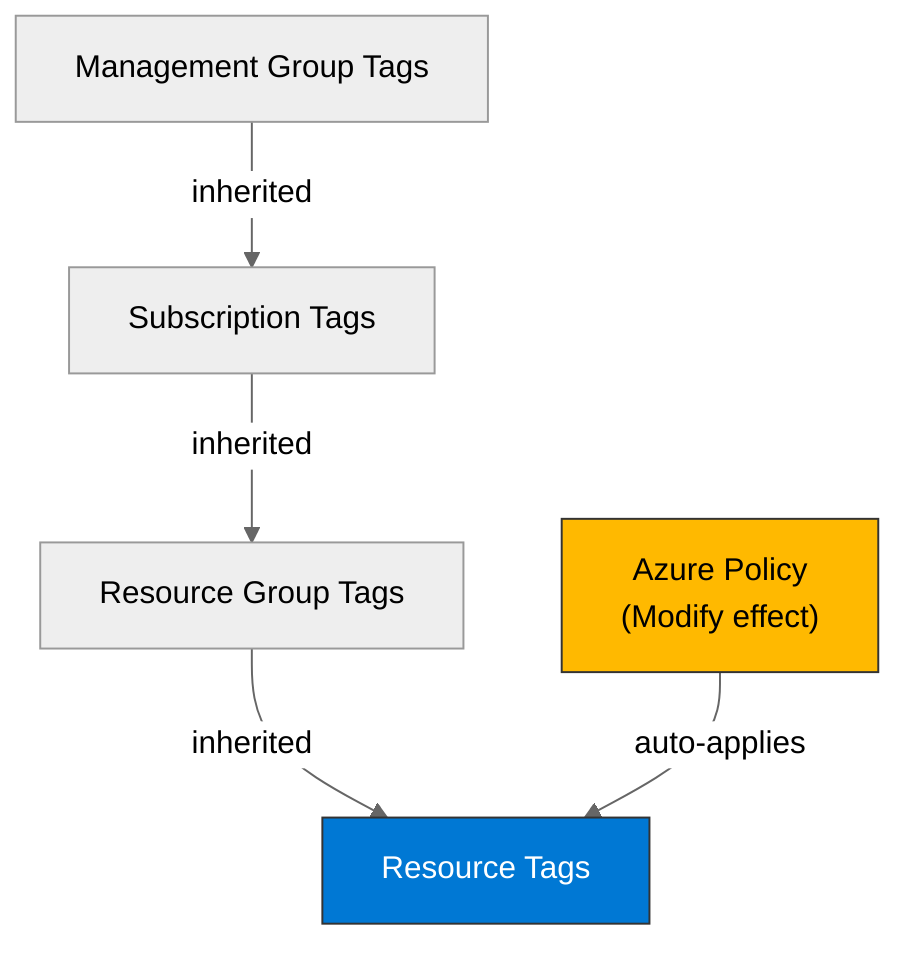

# 🛡️ Governance Constraints - vnext-qualification

<strong>📑 Governance Contents</strong>

- [🔍 Discovery Source](#-discovery-source)
- [📋 Azure Policy Compliance](#-azure-policy-compliance)
- [🔄 Plan Adaptations Based on Policies](#-plan-adaptations-based-on-policies)
- [🚫 Deployment Blockers](#-deployment-blockers)
- [🏷️ Required Tags](#-required-tags)
- [🔐 Security Policies](#-security-policies)
- [💰 Cost Policies](#-cost-policies)
- [🌐 Network Policies](#-network-policies)
- [📜 Compliance Frameworks](#-compliance-frameworks)
- [References](#references)

> Generated by 04g-Governance agent | 2026-07-17T07:02:58Z

| ⬅️ Previous | 📑 Index | Next ➡️ |
| --- | --- | --- |
| [02-architecture-assessment.md](02-architecture-assessment.md) | [README](README.md) | [04-implementation-plan.md](04-implementation-plan.md) |

## 🔍 Discovery Source

| Query | Results | Timestamp |
| --- | --- | --- |
| Policy Assignments | 33 policies discovered | 2026-07-17T07:02:58Z |
| Tag Policies | 10 tags required | 2026-07-17T07:02:58Z |
| Security Policies | 10 constraints | 2026-07-17T07:02:58Z |

**Discovery Method**: Azure Policy REST API (discover.py)
**Subscription**: 00858ffc-dded-4f0f-8bbf-e17fff0d47d9
**Scope**: Subscription + management-group inherited

> ⚠️ **18 deployment blocker(s)** detected. Review the [Deployment Blockers](#-deployment-blockers) section before proceeding to IaC planning.

### Policy Definition Analysis

| Policy Display Name | Assignment Scope | Effect | Classification | Category | Bicep Property Path | Required Value |
| --- | --- | --- | --- | --- | --- | --- |
| Block VM SKU Sizes | /providers/Microsoft.Management/managementGroups/2d04cb4c-999b-4e60-a3a7-e8993edc768b | deny | blocker | Compute |  | Standard_HB120-16rs_v2, Standard_HB120-16rs_v3, Standard_HB120-32rs_v2, Standard_HB120-32rs_v3, Standard_HB120-64rs_v2, Standard_HB120-64rs_v3, Standard_HB120-96rs_v2, Standard_HB120-96rs_v3, Standard_HB120rs_v2, Standard_HB120rs_v3, Standard_HB60-15rs, Standard_HB60-30rs, Standard_HB60-45rs, Standard_HB60rs, Standard_HC44-16rs, Standard_HC44-32rs, Standard_HC44rs |
| Block VM SKU Sizes | /providers/Microsoft.Management/managementGroups/2d04cb4c-999b-4e60-a3a7-e8993edc768b | deny | blocker | Compute |  | standard_m128, standard_m128-32ms, standard_m128-64ms, standard_m128dms_v2, standard_m128ds_v2, standard_m128m, standard_m128ms, standard_m128ms_v2, standard_m128s, standard_m128s_v2, standard_m16-4ms, standard_m16-8ms, standard_m16ms, standard_m192idms_v2, standard_m192ids_v2, standard_m192ims_v2, standard_m192is_v2, standard_m208ms_v2, standard_m208s_v2, standard_m32-16ms … +24 more |
| Block VM SKU Sizes | /providers/Microsoft.Management/managementGroups/2d04cb4c-999b-4e60-a3a7-e8993edc768b | deny | blocker | Compute |  | standard_nc12, standard_nc12_promo, standard_nc12s_v2, standard_nc12s_v3, standard_nc16ads_a10_v4, standard_nc16as_t4_v3, standard_nc24, standard_nc24r, standard_nc24ads_a100_v4, standard_nc24_promo, standard_nc24s_v2, standard_nc24rs_v3, standard_nc24rs_v2, standard_nc24r_promo, standard_nc6, standard_nc4as_t4_v3, standard_nc48ads_a100_v4, standard_nc32ads_a10_v4, standard_nc24s_v3, standard_nc6_promo … +44 more |
| Deny AKS deployment with agent pool count greater than 10 | /providers/Microsoft.Management/managementGroups/2d04cb4c-999b-4e60-a3a7-e8993edc768b | deny | blocker | Compute | managedClusters::agentPoolProfiles[*] |  |
| Deny VMSS deployment with instance count greater than 10 | /providers/Microsoft.Management/managementGroups/2d04cb4c-999b-4e60-a3a7-e8993edc768b | deny | blocker | Compute | virtualMachineScaleSets::sku.capacity |  |
| Block Azure OpenAI Provisioned Capacity | /providers/Microsoft.Management/managementGroups/2d04cb4c-999b-4e60-a3a7-e8993edc768b | deny | blocker | Cognitive Services | accounts/deployments::sku.name |  |
| Block Azure Sentinel Commitment over 100 | /providers/Microsoft.Management/managementGroups/2d04cb4c-999b-4e60-a3a7-e8993edc768b | deny | blocker | Monitoring | workspaces::sku.capacityReservationLevel |  |
| SFI-ID4.2.2 SQL DB - Safe Secrets Standard | /providers/Microsoft.Management/managementGroups/2d04cb4c-999b-4e60-a3a7-e8993edc768b | deny | blocker | Uncategorized | sqlServers::administrators.azureADOnlyAuthentication |  |
| SFI-ID4.2.4 SQL Managed Instance - Safe Secrets Standard | /providers/Microsoft.Management/managementGroups/2d04cb4c-999b-4e60-a3a7-e8993edc768b | deny | blocker | Uncategorized | managedInstances::administrators.azureADOnlyAuthentication |  |
| Not allowed resource types | /providers/Microsoft.Management/managementGroups/2d04cb4c-999b-4e60-a3a7-e8993edc768b | deny | blocker | General |  | microsoft.classiccompute/virtualmachines, microsoft.classiccompute/virtualmachines/diagnosticsettings, microsoft.classiccompute/virtualmachines/metricdefinitions, microsoft.classiccompute/virtualmachines/metrics, microsoft.classicnetwork/virtualnetworks, microsoft.classicnetwork/virtualnetworks/remotevirtualnetworkpeeringproxies, microsoft.classicnetwork/virtualnetworks/virtualnetworkpeerings, microsoft.classicstorage/checkstorageaccountavailability, microsoft.classicstorage/storageaccounts, microsoft.classicstorage/storageaccounts/blobservices, microsoft.classicstorage/storageaccounts/fileservices, microsoft.classicstorage/storageaccounts/metricdefinitions, microsoft.classicstorage/storageaccounts/metrics, microsoft.classicstorage/storageaccounts/queueservices, microsoft.classicstorage/storageaccounts/services, microsoft.classicstorage/storageaccounts/services/diagnosticsettings, microsoft.classicstorage/storageaccounts/services/metricdefinitions, microsoft.classicstorage/storageaccounts/services/metrics, microsoft.classicstorage/storageaccounts/tableservices, microsoft.classicstorage/storageaccounts/vmimages … +37 more |
| Deny Azure Key Vault Managed HSM with Purge Protection Enabled | /providers/Microsoft.Management/managementGroups/2d04cb4c-999b-4e60-a3a7-e8993edc768b | deny | blocker | Key Vault |  | CostControl |
| Configure Azure Defender for servers to be enabled | /providers/Microsoft.Management/managementGroups/2d04cb4c-999b-4e60-a3a7-e8993edc768b | deployIfNotExists | auto-remediate | Security Center |  |  |
| Configure Microsoft Defender for Key Vault plan | /providers/Microsoft.Management/managementGroups/2d04cb4c-999b-4e60-a3a7-e8993edc768b | deployIfNotExists | auto-remediate | Security Center |  |  |
| Configure Microsoft Defender for Azure Cosmos DB to be enabled | /providers/Microsoft.Management/managementGroups/2d04cb4c-999b-4e60-a3a7-e8993edc768b | deployIfNotExists | auto-remediate | Security Center |  |  |
| Configure Azure Defender for Azure SQL database to be enabled | /providers/Microsoft.Management/managementGroups/2d04cb4c-999b-4e60-a3a7-e8993edc768b | deployIfNotExists | auto-remediate | Security Center |  |  |
| Configure Azure Defender for SQL servers on machines to be enabled | /providers/Microsoft.Management/managementGroups/2d04cb4c-999b-4e60-a3a7-e8993edc768b | deployIfNotExists | auto-remediate | Security Center |  |  |
| Configure Azure Defender for open-source relational databases to be enabled | /providers/Microsoft.Management/managementGroups/2d04cb4c-999b-4e60-a3a7-e8993edc768b | deployIfNotExists | auto-remediate | Security Center |  |  |
| Configure Microsoft Defender for Containers to be enabled | /providers/Microsoft.Management/managementGroups/2d04cb4c-999b-4e60-a3a7-e8993edc768b | deployIfNotExists | auto-remediate | Security Center |  |  |
| Configure Azure Defender for App Service to be enabled | /providers/Microsoft.Management/managementGroups/2d04cb4c-999b-4e60-a3a7-e8993edc768b | deployIfNotExists | auto-remediate | Security Center |  |  |
| Configure Azure Defender for Resource Manager to be enabled | /providers/Microsoft.Management/managementGroups/2d04cb4c-999b-4e60-a3a7-e8993edc768b | deployIfNotExists | auto-remediate | Security Center |  |  |
| Configure Microsoft Defender for Storage to be enabled | /providers/Microsoft.Management/managementGroups/2d04cb4c-999b-4e60-a3a7-e8993edc768b | deployIfNotExists | auto-remediate | Security Center |  |  |
| Configure Microsoft Defender threat protection for AI Services | /providers/Microsoft.Management/managementGroups/2d04cb4c-999b-4e60-a3a7-e8993edc768b | deployIfNotExists | auto-remediate | Security Center |  |  |
| Deploy the Windows Guest Configuration extension to enable Guest Configuration assignments on Windows VMs | /providers/Microsoft.Management/managementGroups/2d04cb4c-999b-4e60-a3a7-e8993edc768b | deployIfNotExists | auto-remediate | Guest Configuration | virtualMachines::extensions/provisioningState |  |
| Add system-assigned managed identity to enable Guest Configuration assignments on virtual machines with no identities | /providers/Microsoft.Management/managementGroups/2d04cb4c-999b-4e60-a3a7-e8993edc768b | modify | auto-remediate | Managed Identity for Guest Configuration | virtualMachines::storageProfile.osDisk.osType | SystemAssigned |
| Add system-assigned managed identity to enable Guest Configuration assignments on VMs with a user-assigned identity | /providers/Microsoft.Management/managementGroups/2d04cb4c-999b-4e60-a3a7-e8993edc768b | modify | auto-remediate | Managed identity for Guest Configuration | virtualMachines::storageProfile.osDisk.osType | [concat(field('identity.type'), ',SystemAssigned')] |
| Ensure secure access to storage account containers | /providers/Microsoft.Management/managementGroups/2d04cb4c-999b-4e60-a3a7-e8993edc768b | modify | auto-remediate | Modify Allow Blob anonymous access | storageAccounts::allowBlobPublicAccess | false |
| SFI-ID4.3.2 Event Hub - Safe Secrets Standard | /providers/Microsoft.Management/managementGroups/2d04cb4c-999b-4e60-a3a7-e8993edc768b | modify | auto-remediate | Uncategorized | namespaces::disableLocalAuth | true |
| SFI-ID4.3.3 Service Bus - Safe Secrets Standard | /providers/Microsoft.Management/managementGroups/2d04cb4c-999b-4e60-a3a7-e8993edc768b | modify | auto-remediate | Uncategorized | namespaces::disableLocalAuth | true |
| SFI-ID4.2.1 Storage Accounts - Safe Secrets Standard | /providers/Microsoft.Management/managementGroups/2d04cb4c-999b-4e60-a3a7-e8993edc768b | modify | auto-remediate | Uncategorized | storageAccounts::allowSharedKeyAccess | false |
| SFI-ID4.2.3 Cosmos DB - Safe Secrets Standard | /providers/Microsoft.Management/managementGroups/2d04cb4c-999b-4e60-a3a7-e8993edc768b | modify | auto-remediate | Uncategorized | databaseAccounts::disableLocalAuth | true |
| Enable Diagnostics Settings for all Cognitive Services | /providers/Microsoft.Management/managementGroups/2d04cb4c-999b-4e60-a3a7-e8993edc768b | deployIfNotExists | auto-remediate | Uncategorized |  |  |
| Azure_AIFoundry_Audit_Enable_Diagnostic_Settings - Hubs | /providers/Microsoft.Management/managementGroups/2d04cb4c-999b-4e60-a3a7-e8993edc768b | deployIfNotExists | auto-remediate | Uncategorized |  |  |
| Azure_AIFoundry_Audit_Enable_Diagnostic_Settings - Projects | /providers/Microsoft.Management/managementGroups/2d04cb4c-999b-4e60-a3a7-e8993edc768b | deployIfNotExists | auto-remediate | Uncategorized |  |  |
| Disable Local auth for all Cognitive Services | /providers/Microsoft.Management/managementGroups/2d04cb4c-999b-4e60-a3a7-e8993edc768b | modify | auto-remediate | Uncategorized | accounts::disableLocalAuth | true |
| Deploy Resource Group McapsGovernance | /providers/Microsoft.Management/managementGroups/2d04cb4c-999b-4e60-a3a7-e8993edc768b | deployIfNotExists | auto-remediate | Uncategorized |  |  |
| Deploy Storage Account for Diagnostic Settings | /providers/Microsoft.Management/managementGroups/2d04cb4c-999b-4e60-a3a7-e8993edc768b | deployIfNotExists | auto-remediate | Uncategorized |  |  |
| AIFoundryHub_PublicNetwork_Modify | /providers/Microsoft.Management/managementGroups/2d04cb4c-999b-4e60-a3a7-e8993edc768b | modify | auto-remediate | Uncategorized | workspaces::publicNetworkAccess | Disabled |
| SFI - Disable public network access on Storage accounts (excluding NSP configured resources) | /providers/Microsoft.Management/managementGroups/2d04cb4c-999b-4e60-a3a7-e8993edc768b | modify | auto-remediate | Network | storageAccounts::publicNetworkAccess | Disabled |
| SFI - Disable public network access on Key Vaults (excluding NSP configured resources) | /providers/Microsoft.Management/managementGroups/2d04cb4c-999b-4e60-a3a7-e8993edc768b | modify | auto-remediate | Network | keyVaults::publicNetworkAccess | Disabled |
| SFI - Disable public network access on Cosmos DB accounts (excluding NSP configured resources) | /providers/Microsoft.Management/managementGroups/2d04cb4c-999b-4e60-a3a7-e8993edc768b | modify | auto-remediate | Network | databaseAccounts::publicNetworkAccess | Disabled |
| SFI - Disable public network access on SQL DB servers (excluding NSP configured resources) | /providers/Microsoft.Management/managementGroups/2d04cb4c-999b-4e60-a3a7-e8993edc768b | modify | auto-remediate | Network | sqlServers::publicNetworkAccess | Disabled |
| Configure Microsoft Defender CSPM plan | /providers/Microsoft.Management/managementGroups/2d04cb4c-999b-4e60-a3a7-e8993edc768b | deployIfNotExists | auto-remediate | Uncategorized |  |  |
| Configure Node OS Auto upgrade on Azure Kubernetes Cluster | /providers/Microsoft.Management/managementGroups/2d04cb4c-999b-4e60-a3a7-e8993edc768b | deployIfNotExists | auto-remediate | Uncategorized | managedClusters::autoUpgradeProfile.nodeOSUpgradeChannel |  |
| JV - Inherit Multiple Tags from Resource Group | /providers/Microsoft.Management/managementGroups/2d04cb4c-999b-4e60-a3a7-e8993edc768b | modify | auto-remediate | Tags |  | environment |
| Block Azure RM Resource Creation | /providers/Microsoft.Management/managementGroups/2d04cb4c-999b-4e60-a3a7-e8993edc768b | deny | blocker | Uncategorized |  |  |
| Multi Factor Authentication Enforcement - Write | /providers/Microsoft.Management/managementGroups/2d04cb4c-999b-4e60-a3a7-e8993edc768b | deny | blocker | System Policy |  |  |
| JV-Enforce Resource Group Tags | /providers/Microsoft.Management/managementGroups/2d04cb4c-999b-4e60-a3a7-e8993edc768b | deny | blocker | Tags | resourceGroups::tags |  |
| Not allowed resource types | /providers/Microsoft.Management/managementGroups/alz | deny | blocker | General |  | Microsoft.MachineLearningServices/workspaces/computes, Microsoft.MachineLearningServices/virtualclusters |
| Not allowed resource types | /providers/Microsoft.Management/managementGroups/alz | deny | blocker | General |  | Microsoft.ClassicCompute/capabilities, Microsoft.ClassicCompute/checkDomainNameAvailability, Microsoft.ClassicCompute/domainNames, Microsoft.ClassicCompute/domainNames/capabilities, Microsoft.ClassicCompute/domainNames/internalLoadBalancers, Microsoft.ClassicCompute/domainNames/serviceCertificates, Microsoft.ClassicCompute/domainNames/slots, Microsoft.ClassicCompute/domainNames/slots/roles, Microsoft.ClassicCompute/domainNames/slots/roles/metricDefinitions, Microsoft.ClassicCompute/domainNames/slots/roles/metrics, Microsoft.ClassicCompute/moveSubscriptionResources, Microsoft.ClassicCompute/operatingSystemFamilies, Microsoft.ClassicCompute/operatingSystems, Microsoft.ClassicCompute/operations, Microsoft.ClassicCompute/operationStatuses, Microsoft.ClassicCompute/quotas, Microsoft.ClassicCompute/resourceTypes, Microsoft.ClassicCompute/validateSubscriptionMoveAvailability, Microsoft.ClassicCompute/virtualMachines, Microsoft.ClassicCompute/virtualMachines/diagnosticSettings … +37 more |
| Add system-assigned managed identity to enable Guest Configuration assignments on virtual machines with no identities | /providers/Microsoft.Management/managementGroups/alz | modify | auto-remediate | Guest Configuration | virtualMachines::storageProfile.osDisk.osType | SystemAssigned |
| Deploy the Linux Guest Configuration extension to enable Guest Configuration assignments on Linux VMs | /providers/Microsoft.Management/managementGroups/alz | deployIfNotExists | auto-remediate | Guest Configuration | virtualMachines::extensions/provisioningState |  |
| Deploy the Windows Guest Configuration extension to enable Guest Configuration assignments on Windows VMs | /providers/Microsoft.Management/managementGroups/alz | deployIfNotExists | auto-remediate | Guest Configuration | virtualMachines::extensions/provisioningState |  |
| Deploy Service Health Action Group | /providers/Microsoft.Management/managementGroups/alz | deployIfNotExists | auto-remediate | Monitoring |  | rg-amba-monitoring-001 |
| Deploy Resource Health Unhealthy Alert | /providers/Microsoft.Management/managementGroups/alz | deployIfNotExists | auto-remediate | Monitoring |  | rg-amba-monitoring-001 |
| Deploy Service Health Advisory Alert | /providers/Microsoft.Management/managementGroups/alz | deployIfNotExists | auto-remediate | Monitoring |  | rg-amba-monitoring-001 |
| Deploy Service Health Incident Alert | /providers/Microsoft.Management/managementGroups/alz | deployIfNotExists | auto-remediate | Monitoring |  | rg-amba-monitoring-001 |
| Deploy Service Health Maintenance Alert | /providers/Microsoft.Management/managementGroups/alz | deployIfNotExists | auto-remediate | Monitoring |  | rg-amba-monitoring-001 |
| Deploy Service Health Security Advisory Alert | /providers/Microsoft.Management/managementGroups/alz | deployIfNotExists | auto-remediate | Monitoring |  | rg-amba-monitoring-001 |
| Deploy AMBA Notification Assets | /providers/Microsoft.Management/managementGroups/alz | deployIfNotExists | auto-remediate | Monitoring |  | rg-amba-monitoring-001 |
| Deploy AMBA Notification Suppression Asset | /providers/Microsoft.Management/managementGroups/alz | deployIfNotExists | auto-remediate | Monitoring |  | rg-amba-monitoring-001 |
| Configure Azure Defender for open-source relational databases to be enabled | /providers/Microsoft.Management/managementGroups/alz | deployIfNotExists | auto-remediate | Security Center |  | vella.jonathan@outlook.com |
| Configure Azure Defender for servers to be enabled | /providers/Microsoft.Management/managementGroups/alz | deployIfNotExists | auto-remediate | Security Center |  | vella.jonathan@outlook.com |
| Configure machines to receive a vulnerability assessment provider | /providers/Microsoft.Management/managementGroups/alz | deployIfNotExists | auto-remediate | Security Center |  | vella.jonathan@outlook.com |
| Configure Azure Defender for SQL servers on machines to be enabled | /providers/Microsoft.Management/managementGroups/alz | deployIfNotExists | auto-remediate | Security Center |  | vella.jonathan@outlook.com |
| Configure Azure Defender for App Service to be enabled | /providers/Microsoft.Management/managementGroups/alz | deployIfNotExists | auto-remediate | Security Center |  | vella.jonathan@outlook.com |
| Configure Microsoft Defender for Storage to be enabled | /providers/Microsoft.Management/managementGroups/alz | deployIfNotExists | auto-remediate | Security Center |  | vella.jonathan@outlook.com |
| Configure Microsoft Defender for Containers to be enabled | /providers/Microsoft.Management/managementGroups/alz | deployIfNotExists | auto-remediate | Security Center |  | vella.jonathan@outlook.com |
| Configure Azure Kubernetes Service clusters to enable Defender profile | /providers/Microsoft.Management/managementGroups/alz | deployIfNotExists | auto-remediate | Kubernetes | managedClusters::securityProfile.defender.securityMonitoring.enabled | vella.jonathan@outlook.com |
| Deploy Azure Policy Add-on to Azure Kubernetes Service clusters | /providers/Microsoft.Management/managementGroups/alz | deployIfNotExists | auto-remediate | Kubernetes | managedClusters::addonProfiles.azurePolicy.enabled | vella.jonathan@outlook.com |
| Configure Microsoft Defender for Key Vault plan | /providers/Microsoft.Management/managementGroups/alz | deployIfNotExists | auto-remediate | Security Center |  | vella.jonathan@outlook.com |
| Configure Azure Defender for Resource Manager to be enabled | /providers/Microsoft.Management/managementGroups/alz | deployIfNotExists | auto-remediate | Security Center |  | vella.jonathan@outlook.com |
| Configure Azure Defender for Azure SQL database to be enabled | /providers/Microsoft.Management/managementGroups/alz | deployIfNotExists | auto-remediate | Security Center |  | vella.jonathan@outlook.com |
| Configure Microsoft Defender for Azure Cosmos DB to be enabled | /providers/Microsoft.Management/managementGroups/alz | deployIfNotExists | auto-remediate | Security Center |  | vella.jonathan@outlook.com |
| Configure Microsoft Defender CSPM to be enabled | /providers/Microsoft.Management/managementGroups/alz | deployIfNotExists | auto-remediate | Security Center |  | vella.jonathan@outlook.com |
| Deploy Microsoft Defender for Cloud Security Contacts | /providers/Microsoft.Management/managementGroups/alz | deployIfNotExists | auto-remediate | Security Center |  | vella.jonathan@outlook.com |
| Deploy export to Log Analytics workspace for Microsoft Defender for Cloud data | /providers/Microsoft.Management/managementGroups/alz | deployIfNotExists | auto-remediate | Security Center |  | vella.jonathan@outlook.com |
| Setup subscriptions to transition to an alternative vulnerability assessment solution | /providers/Microsoft.Management/managementGroups/alz | deployIfNotExists | auto-remediate | Security Center |  | vella.jonathan@outlook.com |
| Configure Azure Defender to be enabled on SQL servers | /providers/Microsoft.Management/managementGroups/alz | deployIfNotExists | auto-remediate | SQL |  |  |
| Configure Azure Defender to be enabled on SQL managed instances | /providers/Microsoft.Management/managementGroups/alz | deployIfNotExists | auto-remediate | SQL | managedInstances::securityAlertPolicies/state |  |
| Configure Microsoft Defender for SQL to be enabled on Synapse workspaces | /providers/Microsoft.Management/managementGroups/alz | deployIfNotExists | auto-remediate | Security Center | workspaces::securityAlertPolicies/state |  |
| Configure Advanced Threat Protection to be enabled on Azure database for PostgreSQL servers | /providers/Microsoft.Management/managementGroups/alz | deployIfNotExists | auto-remediate | SQL | servers::securityAlertPolicies/Default.state |  |
| Configure Advanced Threat Protection to be enabled on Azure database for MySQL servers | /providers/Microsoft.Management/managementGroups/alz | deployIfNotExists | auto-remediate | SQL | servers::securityAlertPolicies/Default.state |  |
| Configure Advanced Threat Protection to be enabled on Azure database for MariaDB servers | /providers/Microsoft.Management/managementGroups/alz | deployIfNotExists | auto-remediate | SQL | servers::securityAlertPolicies/Default.state |  |
| Configure Advanced Threat Protection to be enabled on Azure database for PostgreSQL flexible servers | /providers/Microsoft.Management/managementGroups/alz | deployIfNotExists | auto-remediate | Security Center |  |  |
| Configure Advanced Threat Protection to be enabled on Azure database for MySQL flexible servers | /providers/Microsoft.Management/managementGroups/alz | deployIfNotExists | auto-remediate | Security Center |  |  |
| [Preview]: Deploy Microsoft Defender for Endpoint agent on Windows virtual machines | /providers/Microsoft.Management/managementGroups/alz | deployIfNotExists | auto-remediate | Security Center | virtualMachines::extensions/provisioningState |  |
| [Preview]: Deploy Microsoft Defender for Endpoint agent on Linux virtual machines | /providers/Microsoft.Management/managementGroups/alz | deployIfNotExists | auto-remediate | Security Center | virtualMachines::extensions/provisioningState |  |
| [Preview]: Deploy Microsoft Defender for Endpoint agent on Windows Azure Arc machines | /providers/Microsoft.Management/managementGroups/alz | deployIfNotExists | auto-remediate | Security Center | machines::extensions/provisioningState |  |
| [Preview]: Deploy Microsoft Defender for Endpoint agent on Linux hybrid machines | /providers/Microsoft.Management/managementGroups/alz | deployIfNotExists | auto-remediate | Security Center | machines::extensions/provisioningState |  |
| Configure Microsoft Defender for Endpoint integration settings with Microsoft Defender for Cloud (WDATP) | /providers/Microsoft.Management/managementGroups/alz | deployIfNotExists | auto-remediate | Security Center |  |  |
| Configure Microsoft Defender for Endpoint integration settings with Microsoft Defender for Cloud (WDATP_UNIFIED_SOLUTION) | /providers/Microsoft.Management/managementGroups/alz | deployIfNotExists | auto-remediate | Security Center |  |  |
| Configure Microsoft Defender for Endpoint integration settings with Microsoft Defender for Cloud (WDATP_EXCLUDE_LINUX...) | /providers/Microsoft.Management/managementGroups/alz | deployIfNotExists | auto-remediate | Security Center |  |  |
| Configure Azure Activity logs to stream to specified Log Analytics workspace | /providers/Microsoft.Management/managementGroups/alz | deployIfNotExists | auto-remediate | Monitoring |  | /subscriptions/4d4d9df0-45be-4400-b5e0-cc16ca2ce541/resourceGroups/alz-mgmt/providers/Microsoft.OperationalInsights/workspaces/alz-law |
| Inherit a tag from the resource group | /providers/Microsoft.Management/managementGroups/alz | modify | auto-remediate | Tags |  | [resourceGroup().tags[parameters('tagName')]] |
| Inherit a tag from the resource group | /providers/Microsoft.Management/managementGroups/alz | modify | auto-remediate | Tags |  | [resourceGroup().tags[parameters('tagName')]] |
| Inherit a tag from the resource group | /providers/Microsoft.Management/managementGroups/alz | modify | auto-remediate | Tags |  | [resourceGroup().tags[parameters('tagName')]] |
| Not allowed resource types | /providers/Microsoft.Management/managementGroups/alz-sandboxes | deny | blocker | General |  | microsoft.network/expressroutecircuits, microsoft.network/expressroutegateways, microsoft.network/expressrouteports, microsoft.network/virtualwans, microsoft.network/virtualhubs, microsoft.network/vpngateways, microsoft.network/p2svpngateways, microsoft.network/vpnsites, microsoft.network/virtualnetworkgateways |
| Deny vNet peering cross subscription. | /providers/Microsoft.Management/managementGroups/alz-sandboxes | deny | blocker | Network | virtualNetworks/virtualNetworkPeerings::remoteVirtualNetwork.id | microsoft.network/expressroutecircuits, microsoft.network/expressroutegateways, microsoft.network/expressrouteports, microsoft.network/virtualwans, microsoft.network/virtualhubs, microsoft.network/vpngateways, microsoft.network/p2svpngateways, microsoft.network/vpnsites, microsoft.network/virtualnetworkgateways |
| Configure backup on virtual machines with a given tag to an existing recovery services vault in the same location | /subscriptions/00858ffc-dded-4f0f-8bbf-e17fff0d47d9 | deployIfNotExists | auto-remediate | Backup |  | swedencentral |

## 📋 Azure Policy Compliance

> **Note**: No architecture assessment provided. IaC impact annotations will be populated during Step 4 (IaC Planning).

| Category | Constraint | Implementation | Status |
| --- | --- | --- | --- |
| Backup | Configure backup on virtual machines with a given tag to an existing recovery services vault in the same location | Auto-applied by Azure Policy | ✅ |
| Cognitive Services | Block Azure OpenAI Provisioned Capacity | Blocked — must comply before deployment | ❌ |
| Compute | Block VM SKU Sizes | Blocked — must comply before deployment | ❌ |
| Compute | Block VM SKU Sizes | Blocked — must comply before deployment | ❌ |
| Compute | Block VM SKU Sizes | Blocked — must comply before deployment | ❌ |
| Compute | Deny AKS deployment with agent pool count greater than 10 | Blocked — must comply before deployment | ❌ |
| Compute | Deny VMSS deployment with instance count greater than 10 | Blocked — must comply before deployment | ❌ |
| General | Not allowed resource types | Blocked — must comply before deployment | ❌ |
| General | Not allowed resource types | Blocked — must comply before deployment | ❌ |
| General | Not allowed resource types | Blocked — must comply before deployment | ❌ |
| General | Not allowed resource types | Blocked — must comply before deployment | ❌ |
| Guest Configuration | Deploy the Windows Guest Configuration extension to enable Guest Configuration assignments on Windows VMs | Auto-applied by Azure Policy | ✅ |
| Guest Configuration | Add system-assigned managed identity to enable Guest Configuration assignments on virtual machines with no identities | Auto-applied by Azure Policy | ✅ |
| Guest Configuration | Deploy the Linux Guest Configuration extension to enable Guest Configuration assignments on Linux VMs | Auto-applied by Azure Policy | ✅ |
| Guest Configuration | Deploy the Windows Guest Configuration extension to enable Guest Configuration assignments on Windows VMs | Auto-applied by Azure Policy | ✅ |
| Key Vault | Deny Azure Key Vault Managed HSM with Purge Protection Enabled | Blocked — must comply before deployment | ❌ |
| Kubernetes | Configure Azure Kubernetes Service clusters to enable Defender profile | Auto-applied by Azure Policy | ✅ |
| Kubernetes | Deploy Azure Policy Add-on to Azure Kubernetes Service clusters | Auto-applied by Azure Policy | ✅ |
| Managed Identity for Guest Configuration | Add system-assigned managed identity to enable Guest Configuration assignments on virtual machines with no identities | Auto-applied by Azure Policy | ✅ |
| Managed identity for Guest Configuration | Add system-assigned managed identity to enable Guest Configuration assignments on VMs with a user-assigned identity | Auto-applied by Azure Policy | ✅ |
| Modify Allow Blob anonymous access | Ensure secure access to storage account containers | Auto-applied by Azure Policy | ✅ |
| Monitoring | Block Azure Sentinel Commitment over 100 | Blocked — must comply before deployment | ❌ |
| Monitoring | Deploy Service Health Action Group | Auto-applied by Azure Policy | ✅ |
| Monitoring | Deploy Resource Health Unhealthy Alert | Auto-applied by Azure Policy | ✅ |
| Monitoring | Deploy Service Health Advisory Alert | Auto-applied by Azure Policy | ✅ |
| Monitoring | Deploy Service Health Incident Alert | Auto-applied by Azure Policy | ✅ |
| Monitoring | Deploy Service Health Maintenance Alert | Auto-applied by Azure Policy | ✅ |
| Monitoring | Deploy Service Health Security Advisory Alert | Auto-applied by Azure Policy | ✅ |
| Monitoring | Deploy AMBA Notification Assets | Auto-applied by Azure Policy | ✅ |
| Monitoring | Deploy AMBA Notification Suppression Asset | Auto-applied by Azure Policy | ✅ |
| Monitoring | Configure Azure Activity logs to stream to specified Log Analytics workspace | Auto-applied by Azure Policy | ✅ |
| Network | SFI - Disable public network access on Storage accounts (excluding NSP configured resources) | Auto-applied by Azure Policy | ✅ |
| Network | SFI - Disable public network access on Key Vaults (excluding NSP configured resources) | Auto-applied by Azure Policy | ✅ |
| Network | SFI - Disable public network access on Cosmos DB accounts (excluding NSP configured resources) | Auto-applied by Azure Policy | ✅ |
| Network | SFI - Disable public network access on SQL DB servers (excluding NSP configured resources) | Auto-applied by Azure Policy | ✅ |
| Network | Deny vNet peering cross subscription. | Blocked — must comply before deployment | ❌ |
| SQL | Configure Azure Defender to be enabled on SQL servers | Auto-applied by Azure Policy | ✅ |
| SQL | Configure Azure Defender to be enabled on SQL managed instances | Auto-applied by Azure Policy | ✅ |
| SQL | Configure Advanced Threat Protection to be enabled on Azure database for PostgreSQL servers | Auto-applied by Azure Policy | ✅ |
| SQL | Configure Advanced Threat Protection to be enabled on Azure database for MySQL servers | Auto-applied by Azure Policy | ✅ |
| SQL | Configure Advanced Threat Protection to be enabled on Azure database for MariaDB servers | Auto-applied by Azure Policy | ✅ |
| Security Center | Configure Azure Defender for servers to be enabled | Auto-applied by Azure Policy | ✅ |
| Security Center | Configure Microsoft Defender for Key Vault plan | Auto-applied by Azure Policy | ✅ |
| Security Center | Configure Microsoft Defender for Azure Cosmos DB to be enabled | Auto-applied by Azure Policy | ✅ |
| Security Center | Configure Azure Defender for Azure SQL database to be enabled | Auto-applied by Azure Policy | ✅ |
| Security Center | Configure Azure Defender for SQL servers on machines to be enabled | Auto-applied by Azure Policy | ✅ |
| Security Center | Configure Azure Defender for open-source relational databases to be enabled | Auto-applied by Azure Policy | ✅ |
| Security Center | Configure Microsoft Defender for Containers to be enabled | Auto-applied by Azure Policy | ✅ |
| Security Center | Configure Azure Defender for App Service to be enabled | Auto-applied by Azure Policy | ✅ |
| Security Center | Configure Azure Defender for Resource Manager to be enabled | Auto-applied by Azure Policy | ✅ |
| Security Center | Configure Microsoft Defender for Storage to be enabled | Auto-applied by Azure Policy | ✅ |
| Security Center | Configure Microsoft Defender threat protection for AI Services | Auto-applied by Azure Policy | ✅ |
| Security Center | Configure Azure Defender for open-source relational databases to be enabled | Auto-applied by Azure Policy | ✅ |
| Security Center | Configure Azure Defender for servers to be enabled | Auto-applied by Azure Policy | ✅ |
| Security Center | Configure machines to receive a vulnerability assessment provider | Auto-applied by Azure Policy | ✅ |
| Security Center | Configure Azure Defender for SQL servers on machines to be enabled | Auto-applied by Azure Policy | ✅ |
| Security Center | Configure Azure Defender for App Service to be enabled | Auto-applied by Azure Policy | ✅ |
| Security Center | Configure Microsoft Defender for Storage to be enabled | Auto-applied by Azure Policy | ✅ |
| Security Center | Configure Microsoft Defender for Containers to be enabled | Auto-applied by Azure Policy | ✅ |
| Security Center | Configure Microsoft Defender for Key Vault plan | Auto-applied by Azure Policy | ✅ |
| Security Center | Configure Azure Defender for Resource Manager to be enabled | Auto-applied by Azure Policy | ✅ |
| Security Center | Configure Azure Defender for Azure SQL database to be enabled | Auto-applied by Azure Policy | ✅ |
| Security Center | Configure Microsoft Defender for Azure Cosmos DB to be enabled | Auto-applied by Azure Policy | ✅ |
| Security Center | Configure Microsoft Defender CSPM to be enabled | Auto-applied by Azure Policy | ✅ |
| Security Center | Deploy Microsoft Defender for Cloud Security Contacts | Auto-applied by Azure Policy | ✅ |
| Security Center | Deploy export to Log Analytics workspace for Microsoft Defender for Cloud data | Auto-applied by Azure Policy | ✅ |
| Security Center | Setup subscriptions to transition to an alternative vulnerability assessment solution | Auto-applied by Azure Policy | ✅ |
| Security Center | Configure Microsoft Defender for SQL to be enabled on Synapse workspaces | Auto-applied by Azure Policy | ✅ |
| Security Center | Configure Advanced Threat Protection to be enabled on Azure database for PostgreSQL flexible servers | Auto-applied by Azure Policy | ✅ |
| Security Center | Configure Advanced Threat Protection to be enabled on Azure database for MySQL flexible servers | Auto-applied by Azure Policy | ✅ |
| Security Center | [Preview]: Deploy Microsoft Defender for Endpoint agent on Windows virtual machines | Auto-applied by Azure Policy | ✅ |
| Security Center | [Preview]: Deploy Microsoft Defender for Endpoint agent on Linux virtual machines | Auto-applied by Azure Policy | ✅ |
| Security Center | [Preview]: Deploy Microsoft Defender for Endpoint agent on Windows Azure Arc machines | Auto-applied by Azure Policy | ✅ |
| Security Center | [Preview]: Deploy Microsoft Defender for Endpoint agent on Linux hybrid machines | Auto-applied by Azure Policy | ✅ |
| Security Center | Configure Microsoft Defender for Endpoint integration settings with Microsoft Defender for Cloud (WDATP) | Auto-applied by Azure Policy | ✅ |
| Security Center | Configure Microsoft Defender for Endpoint integration settings with Microsoft Defender for Cloud (WDATP_UNIFIED_SOLUTION) | Auto-applied by Azure Policy | ✅ |
| Security Center | Configure Microsoft Defender for Endpoint integration settings with Microsoft Defender for Cloud (WDATP_EXCLUDE_LINUX...) | Auto-applied by Azure Policy | ✅ |
| System Policy | Multi Factor Authentication Enforcement - Write | Blocked — must comply before deployment | ❌ |
| Tags | JV - Inherit Multiple Tags from Resource Group | Auto-applied by Azure Policy | ✅ |
| Tags | JV-Enforce Resource Group Tags | Blocked — must comply before deployment | ❌ |
| Tags | Inherit a tag from the resource group | Auto-applied by Azure Policy | ✅ |
| Tags | Inherit a tag from the resource group | Auto-applied by Azure Policy | ✅ |
| Tags | Inherit a tag from the resource group | Auto-applied by Azure Policy | ✅ |
| Uncategorized | SFI-ID4.2.2 SQL DB - Safe Secrets Standard | Blocked — must comply before deployment | ❌ |
| Uncategorized | SFI-ID4.2.4 SQL Managed Instance - Safe Secrets Standard | Blocked — must comply before deployment | ❌ |
| Uncategorized | SFI-ID4.3.2 Event Hub - Safe Secrets Standard | Auto-applied by Azure Policy | ✅ |
| Uncategorized | SFI-ID4.3.3 Service Bus - Safe Secrets Standard | Auto-applied by Azure Policy | ✅ |
| Uncategorized | SFI-ID4.2.1 Storage Accounts - Safe Secrets Standard | Auto-applied by Azure Policy | ✅ |
| Uncategorized | SFI-ID4.2.3 Cosmos DB - Safe Secrets Standard | Auto-applied by Azure Policy | ✅ |
| Uncategorized | Enable Diagnostics Settings for all Cognitive Services | Auto-applied by Azure Policy | ✅ |
| Uncategorized | Azure_AIFoundry_Audit_Enable_Diagnostic_Settings - Hubs | Auto-applied by Azure Policy | ✅ |
| Uncategorized | Azure_AIFoundry_Audit_Enable_Diagnostic_Settings - Projects | Auto-applied by Azure Policy | ✅ |
| Uncategorized | Disable Local auth for all Cognitive Services | Auto-applied by Azure Policy | ✅ |
| Uncategorized | Deploy Resource Group McapsGovernance | Auto-applied by Azure Policy | ✅ |
| Uncategorized | Deploy Storage Account for Diagnostic Settings | Auto-applied by Azure Policy | ✅ |
| Uncategorized | AIFoundryHub_PublicNetwork_Modify | Auto-applied by Azure Policy | ✅ |
| Uncategorized | Configure Microsoft Defender CSPM plan | Auto-applied by Azure Policy | ✅ |
| Uncategorized | Configure Node OS Auto upgrade on Azure Kubernetes Cluster | Auto-applied by Azure Policy | ✅ |
| Uncategorized | Block Azure RM Resource Creation | Blocked — must comply before deployment | ❌ |

## 🔄 Plan Adaptations Based on Policies

### Architectural Changes

| Original Design | Blocking Policy | Effect | Adaptation Applied |
| --- | --- | --- | --- |
| No architecture target | Block VM SKU Sizes | deny | Review at Step 4 IaC Planning |
| No architecture target | Block VM SKU Sizes | deny | Review at Step 4 IaC Planning |
| No architecture target | Block VM SKU Sizes | deny | Review at Step 4 IaC Planning |
| No architecture target | Deny AKS deployment with agent pool count greater than 10 | deny | Review at Step 4 IaC Planning |
| No architecture target | Deny VMSS deployment with instance count greater than 10 | deny | Review at Step 4 IaC Planning |
| No architecture target | Block Azure OpenAI Provisioned Capacity | deny | Review at Step 4 IaC Planning |
| No architecture target | Block Azure Sentinel Commitment over 100 | deny | Review at Step 4 IaC Planning |
| No architecture target | SFI-ID4.2.2 SQL DB - Safe Secrets Standard | deny | Review at Step 4 IaC Planning |
| No architecture target | SFI-ID4.2.4 SQL Managed Instance - Safe Secrets Standard | deny | Review at Step 4 IaC Planning |
| No architecture target | Not allowed resource types | deny | Review at Step 4 IaC Planning |
| No architecture target | Deny Azure Key Vault Managed HSM with Purge Protection Enabled | deny | Review at Step 4 IaC Planning |
| No architecture target | Block Azure RM Resource Creation | deny | Review at Step 4 IaC Planning |
| No architecture target | Multi Factor Authentication Enforcement - Write | deny | Review at Step 4 IaC Planning |
| No architecture target | JV-Enforce Resource Group Tags | deny | Review at Step 4 IaC Planning |
| No architecture target | Not allowed resource types | deny | Review at Step 4 IaC Planning |
| No architecture target | Not allowed resource types | deny | Review at Step 4 IaC Planning |
| No architecture target | Not allowed resource types | deny | Review at Step 4 IaC Planning |
| No architecture target | Deny vNet peering cross subscription. | deny | Review at Step 4 IaC Planning |

### Auto-Applied Resources

| Policy | Effect | Auto-Applied Resource |
| --- | --- | --- |
| Configure Azure Defender for servers to be enabled | DeployIfNotExists | Auto-deployed by Azure Policy |
| Configure Microsoft Defender for Key Vault plan | DeployIfNotExists | Auto-deployed by Azure Policy |
| Configure Microsoft Defender for Azure Cosmos DB to be enabled | DeployIfNotExists | Auto-deployed by Azure Policy |
| Configure Azure Defender for Azure SQL database to be enabled | DeployIfNotExists | Auto-deployed by Azure Policy |
| Configure Azure Defender for SQL servers on machines to be enabled | DeployIfNotExists | Auto-deployed by Azure Policy |
| Configure Azure Defender for open-source relational databases to be enabled | DeployIfNotExists | Auto-deployed by Azure Policy |
| Configure Microsoft Defender for Containers to be enabled | DeployIfNotExists | Auto-deployed by Azure Policy |
| Configure Azure Defender for App Service to be enabled | DeployIfNotExists | Auto-deployed by Azure Policy |
| Configure Azure Defender for Resource Manager to be enabled | DeployIfNotExists | Auto-deployed by Azure Policy |
| Configure Microsoft Defender for Storage to be enabled | DeployIfNotExists | Auto-deployed by Azure Policy |
| Configure Microsoft Defender threat protection for AI Services | DeployIfNotExists | Auto-deployed by Azure Policy |
| Deploy the Windows Guest Configuration extension to enable Guest Configuration assignments on Windows VMs | DeployIfNotExists | Auto-deployed by Azure Policy |
| Enable Diagnostics Settings for all Cognitive Services | DeployIfNotExists | Auto-deployed by Azure Policy |
| Azure_AIFoundry_Audit_Enable_Diagnostic_Settings - Hubs | DeployIfNotExists | Auto-deployed by Azure Policy |
| Azure_AIFoundry_Audit_Enable_Diagnostic_Settings - Projects | DeployIfNotExists | Auto-deployed by Azure Policy |
| Deploy Resource Group McapsGovernance | DeployIfNotExists | Auto-deployed by Azure Policy |
| Deploy Storage Account for Diagnostic Settings | DeployIfNotExists | Auto-deployed by Azure Policy |
| Configure Microsoft Defender CSPM plan | DeployIfNotExists | Auto-deployed by Azure Policy |
| Configure Node OS Auto upgrade on Azure Kubernetes Cluster | DeployIfNotExists | Auto-deployed by Azure Policy |
| Deploy the Linux Guest Configuration extension to enable Guest Configuration assignments on Linux VMs | DeployIfNotExists | Auto-deployed by Azure Policy |
| Deploy the Windows Guest Configuration extension to enable Guest Configuration assignments on Windows VMs | DeployIfNotExists | Auto-deployed by Azure Policy |
| Deploy Service Health Action Group | DeployIfNotExists | Auto-deployed by Azure Policy |
| Deploy Resource Health Unhealthy Alert | DeployIfNotExists | Auto-deployed by Azure Policy |
| Deploy Service Health Advisory Alert | DeployIfNotExists | Auto-deployed by Azure Policy |
| Deploy Service Health Incident Alert | DeployIfNotExists | Auto-deployed by Azure Policy |
| Deploy Service Health Maintenance Alert | DeployIfNotExists | Auto-deployed by Azure Policy |
| Deploy Service Health Security Advisory Alert | DeployIfNotExists | Auto-deployed by Azure Policy |
| Deploy AMBA Notification Assets | DeployIfNotExists | Auto-deployed by Azure Policy |
| Deploy AMBA Notification Suppression Asset | DeployIfNotExists | Auto-deployed by Azure Policy |
| Configure Azure Defender for open-source relational databases to be enabled | DeployIfNotExists | Auto-deployed by Azure Policy |
| Configure Azure Defender for servers to be enabled | DeployIfNotExists | Auto-deployed by Azure Policy |
| Configure machines to receive a vulnerability assessment provider | DeployIfNotExists | Auto-deployed by Azure Policy |
| Configure Azure Defender for SQL servers on machines to be enabled | DeployIfNotExists | Auto-deployed by Azure Policy |
| Configure Azure Defender for App Service to be enabled | DeployIfNotExists | Auto-deployed by Azure Policy |
| Configure Microsoft Defender for Storage to be enabled | DeployIfNotExists | Auto-deployed by Azure Policy |
| Configure Microsoft Defender for Containers to be enabled | DeployIfNotExists | Auto-deployed by Azure Policy |
| Configure Azure Kubernetes Service clusters to enable Defender profile | DeployIfNotExists | Auto-deployed by Azure Policy |
| Deploy Azure Policy Add-on to Azure Kubernetes Service clusters | DeployIfNotExists | Auto-deployed by Azure Policy |
| Configure Microsoft Defender for Key Vault plan | DeployIfNotExists | Auto-deployed by Azure Policy |
| Configure Azure Defender for Resource Manager to be enabled | DeployIfNotExists | Auto-deployed by Azure Policy |
| Configure Azure Defender for Azure SQL database to be enabled | DeployIfNotExists | Auto-deployed by Azure Policy |
| Configure Microsoft Defender for Azure Cosmos DB to be enabled | DeployIfNotExists | Auto-deployed by Azure Policy |
| Configure Microsoft Defender CSPM to be enabled | DeployIfNotExists | Auto-deployed by Azure Policy |
| Deploy Microsoft Defender for Cloud Security Contacts | DeployIfNotExists | Auto-deployed by Azure Policy |
| Deploy export to Log Analytics workspace for Microsoft Defender for Cloud data | DeployIfNotExists | Auto-deployed by Azure Policy |
| Setup subscriptions to transition to an alternative vulnerability assessment solution | DeployIfNotExists | Auto-deployed by Azure Policy |
| Configure Azure Defender to be enabled on SQL servers | DeployIfNotExists | Auto-deployed by Azure Policy |
| Configure Azure Defender to be enabled on SQL managed instances | DeployIfNotExists | Auto-deployed by Azure Policy |
| Configure Microsoft Defender for SQL to be enabled on Synapse workspaces | DeployIfNotExists | Auto-deployed by Azure Policy |
| Configure Advanced Threat Protection to be enabled on Azure database for PostgreSQL servers | DeployIfNotExists | Auto-deployed by Azure Policy |
| Configure Advanced Threat Protection to be enabled on Azure database for MySQL servers | DeployIfNotExists | Auto-deployed by Azure Policy |
| Configure Advanced Threat Protection to be enabled on Azure database for MariaDB servers | DeployIfNotExists | Auto-deployed by Azure Policy |
| Configure Advanced Threat Protection to be enabled on Azure database for PostgreSQL flexible servers | DeployIfNotExists | Auto-deployed by Azure Policy |
| Configure Advanced Threat Protection to be enabled on Azure database for MySQL flexible servers | DeployIfNotExists | Auto-deployed by Azure Policy |
| [Preview]: Deploy Microsoft Defender for Endpoint agent on Windows virtual machines | DeployIfNotExists | Auto-deployed by Azure Policy |
| [Preview]: Deploy Microsoft Defender for Endpoint agent on Linux virtual machines | DeployIfNotExists | Auto-deployed by Azure Policy |
| [Preview]: Deploy Microsoft Defender for Endpoint agent on Windows Azure Arc machines | DeployIfNotExists | Auto-deployed by Azure Policy |
| [Preview]: Deploy Microsoft Defender for Endpoint agent on Linux hybrid machines | DeployIfNotExists | Auto-deployed by Azure Policy |
| Configure Microsoft Defender for Endpoint integration settings with Microsoft Defender for Cloud (WDATP) | DeployIfNotExists | Auto-deployed by Azure Policy |
| Configure Microsoft Defender for Endpoint integration settings with Microsoft Defender for Cloud (WDATP_UNIFIED_SOLUTION) | DeployIfNotExists | Auto-deployed by Azure Policy |
| Configure Microsoft Defender for Endpoint integration settings with Microsoft Defender for Cloud (WDATP_EXCLUDE_LINUX...) | DeployIfNotExists | Auto-deployed by Azure Policy |
| Configure Azure Activity logs to stream to specified Log Analytics workspace | DeployIfNotExists | Auto-deployed by Azure Policy |
| Configure backup on virtual machines with a given tag to an existing recovery services vault in the same location | DeployIfNotExists | Auto-deployed by Azure Policy |

### Auto-Modified Configurations

| Policy | Effect | Auto-Applied Change |
| --- | --- | --- |
| Add system-assigned managed identity to enable Guest Configuration assignments on virtual machines with no identities | Modify | Auto-modified by Azure Policy |
| Add system-assigned managed identity to enable Guest Configuration assignments on VMs with a user-assigned identity | Modify | Auto-modified by Azure Policy |
| Ensure secure access to storage account containers | Modify | Auto-modified by Azure Policy |
| SFI-ID4.3.2 Event Hub - Safe Secrets Standard | Modify | Auto-modified by Azure Policy |
| SFI-ID4.3.3 Service Bus - Safe Secrets Standard | Modify | Auto-modified by Azure Policy |
| SFI-ID4.2.1 Storage Accounts - Safe Secrets Standard | Modify | Auto-modified by Azure Policy |
| SFI-ID4.2.3 Cosmos DB - Safe Secrets Standard | Modify | Auto-modified by Azure Policy |
| Disable Local auth for all Cognitive Services | Modify | Auto-modified by Azure Policy |
| AIFoundryHub_PublicNetwork_Modify | Modify | Auto-modified by Azure Policy |
| SFI - Disable public network access on Storage accounts (excluding NSP configured resources) | Modify | Auto-modified by Azure Policy |
| SFI - Disable public network access on Key Vaults (excluding NSP configured resources) | Modify | Auto-modified by Azure Policy |
| SFI - Disable public network access on Cosmos DB accounts (excluding NSP configured resources) | Modify | Auto-modified by Azure Policy |
| SFI - Disable public network access on SQL DB servers (excluding NSP configured resources) | Modify | Auto-modified by Azure Policy |
| JV - Inherit Multiple Tags from Resource Group | Modify | Auto-modified by Azure Policy |
| Add system-assigned managed identity to enable Guest Configuration assignments on virtual machines with no identities | Modify | Auto-modified by Azure Policy |
| Inherit a tag from the resource group | Modify | Auto-modified by Azure Policy |
| Inherit a tag from the resource group | Modify | Auto-modified by Azure Policy |
| Inherit a tag from the resource group | Modify | Auto-modified by Azure Policy |

## 🚫 Deployment Blockers

> **18** blocker finding(s) from **18** unique policies (duplicates from multi-scope inheritance are consolidated below).

### Block VM SKU Sizes

- **Policy ID**: `/providers/Microsoft.Management/managementGroups/2d04cb4c-999b-4e60-a3a7-e8993edc768b/providers/Microsoft.Authorization/policyDefinitions/VirtualMachine_SKU_Deny`
- **Effect**: deny
- **Scope**: /providers/Microsoft.Management/managementGroups/2d04cb4c-999b-4e60-a3a7-e8993edc768b
- **Category**: Compute
- **Bicep Property Path**: ``
- **Required Value**: Standard_HB120-16rs_v2, Standard_HB120-16rs_v3, Standard_HB120-32rs_v2, Standard_HB120-32rs_v3, Standard_HB120-64rs_v2, Standard_HB120-64rs_v3, Standard_HB120-96rs_v2, Standard_HB120-96rs_v3, Standard_HB120rs_v2, Standard_HB120rs_v3, Standard_HB60-15rs, Standard_HB60-30rs, Standard_HB60-45rs, Standard_HB60rs, Standard_HC44-16rs, Standard_HC44-32rs, Standard_HC44rs

> **Resolution**: Review during Step 4 IaC Planning — apply an exemption, use an allowed alternative, or update the policy scope.

### Block VM SKU Sizes

- **Policy ID**: `/providers/Microsoft.Management/managementGroups/2d04cb4c-999b-4e60-a3a7-e8993edc768b/providers/Microsoft.Authorization/policyDefinitions/VirtualMachine_SKU_Deny`
- **Effect**: deny
- **Scope**: /providers/Microsoft.Management/managementGroups/2d04cb4c-999b-4e60-a3a7-e8993edc768b
- **Category**: Compute
- **Bicep Property Path**: ``
- **Required Value**: standard_m128, standard_m128-32ms, standard_m128-64ms, standard_m128dms_v2, standard_m128ds_v2, standard_m128m, standard_m128ms, standard_m128ms_v2, standard_m128s, standard_m128s_v2, standard_m16-4ms, standard_m16-8ms, standard_m16ms, standard_m192idms_v2, standard_m192ids_v2, standard_m192ims_v2, standard_m192is_v2, standard_m208ms_v2, standard_m208s_v2, standard_m32-16ms … +24 more

> **Resolution**: Review during Step 4 IaC Planning — apply an exemption, use an allowed alternative, or update the policy scope.

### Block VM SKU Sizes

- **Policy ID**: `/providers/Microsoft.Management/managementGroups/2d04cb4c-999b-4e60-a3a7-e8993edc768b/providers/Microsoft.Authorization/policyDefinitions/VirtualMachine_SKU_Deny`
- **Effect**: deny
- **Scope**: /providers/Microsoft.Management/managementGroups/2d04cb4c-999b-4e60-a3a7-e8993edc768b
- **Category**: Compute
- **Bicep Property Path**: ``
- **Required Value**: standard_nc12, standard_nc12_promo, standard_nc12s_v2, standard_nc12s_v3, standard_nc16ads_a10_v4, standard_nc16as_t4_v3, standard_nc24, standard_nc24r, standard_nc24ads_a100_v4, standard_nc24_promo, standard_nc24s_v2, standard_nc24rs_v3, standard_nc24rs_v2, standard_nc24r_promo, standard_nc6, standard_nc4as_t4_v3, standard_nc48ads_a100_v4, standard_nc32ads_a10_v4, standard_nc24s_v3, standard_nc6_promo … +44 more

> **Resolution**: Review during Step 4 IaC Planning — apply an exemption, use an allowed alternative, or update the policy scope.

### Deny AKS deployment with agent pool count greater than 10

- **Policy ID**: `/providers/Microsoft.Management/managementGroups/2d04cb4c-999b-4e60-a3a7-e8993edc768b/providers/Microsoft.Authorization/policyDefinitions/AKS_LimitNodeCount_Deny`
- **Effect**: deny
- **Scope**: /providers/Microsoft.Management/managementGroups/2d04cb4c-999b-4e60-a3a7-e8993edc768b
- **Category**: Compute
- **Bicep Property Path**: `managedClusters::agentPoolProfiles[*]`
- **Required Value**: N/A — parameter values not available in cached baseline; run `--refresh` for live lookup

> **Resolution**: Review during Step 4 IaC Planning — apply an exemption, use an allowed alternative, or update the policy scope.

### Deny VMSS deployment with instance count greater than 10

- **Policy ID**: `/providers/Microsoft.Management/managementGroups/2d04cb4c-999b-4e60-a3a7-e8993edc768b/providers/Microsoft.Authorization/policyDefinitions/VMSS_LimitNodesCount_Deny`
- **Effect**: deny
- **Scope**: /providers/Microsoft.Management/managementGroups/2d04cb4c-999b-4e60-a3a7-e8993edc768b
- **Category**: Compute
- **Bicep Property Path**: `virtualMachineScaleSets::sku.capacity`
- **Required Value**: N/A — parameter values not available in cached baseline; run `--refresh` for live lookup

> **Resolution**: Review during Step 4 IaC Planning — apply an exemption, use an allowed alternative, or update the policy scope.

### Block Azure OpenAI Provisioned Capacity

- **Policy ID**: `/providers/Microsoft.Management/managementGroups/2d04cb4c-999b-4e60-a3a7-e8993edc768b/providers/Microsoft.Authorization/policyDefinitions/AzureOpenAI_ProvisionedCapacity_Deny`
- **Effect**: deny
- **Scope**: /providers/Microsoft.Management/managementGroups/2d04cb4c-999b-4e60-a3a7-e8993edc768b
- **Category**: Cognitive Services
- **Bicep Property Path**: `accounts/deployments::sku.name`
- **Required Value**: N/A — parameter values not available in cached baseline; run `--refresh` for live lookup

> **Resolution**: Review during Step 4 IaC Planning — apply an exemption, use an allowed alternative, or update the policy scope.

### Block Azure Sentinel Commitment over 100

- **Policy ID**: `/providers/Microsoft.Management/managementGroups/2d04cb4c-999b-4e60-a3a7-e8993edc768b/providers/Microsoft.Authorization/policyDefinitions/Sentinel_Commitment_Deny`
- **Effect**: deny
- **Scope**: /providers/Microsoft.Management/managementGroups/2d04cb4c-999b-4e60-a3a7-e8993edc768b
- **Category**: Monitoring
- **Bicep Property Path**: `workspaces::sku.capacityReservationLevel`
- **Required Value**: N/A — parameter values not available in cached baseline; run `--refresh` for live lookup

> **Resolution**: Review during Step 4 IaC Planning — apply an exemption, use an allowed alternative, or update the policy scope.

### SFI-ID4.2.2 SQL DB - Safe Secrets Standard

- **Policy ID**: `/providers/Microsoft.Management/managementGroups/2d04cb4c-999b-4e60-a3a7-e8993edc768b/providers/Microsoft.Authorization/policyDefinitions/AzureSQL_WithoutAzureADOnlyAuthentication_Deny`
- **Effect**: deny
- **Scope**: /providers/Microsoft.Management/managementGroups/2d04cb4c-999b-4e60-a3a7-e8993edc768b
- **Category**: Uncategorized
- **Bicep Property Path**: `sqlServers::administrators.azureADOnlyAuthentication`
- **Required Value**: N/A — parameter values not available in cached baseline; run `--refresh` for live lookup

> **Resolution**: Review during Step 4 IaC Planning — apply an exemption, use an allowed alternative, or update the policy scope.

### SFI-ID4.2.4 SQL Managed Instance - Safe Secrets Standard

- **Policy ID**: `/providers/Microsoft.Management/managementGroups/2d04cb4c-999b-4e60-a3a7-e8993edc768b/providers/Microsoft.Authorization/policyDefinitions/AzureSQLMI_WithoutAzureADOnlyAuthentication_Deny`
- **Effect**: deny
- **Scope**: /providers/Microsoft.Management/managementGroups/2d04cb4c-999b-4e60-a3a7-e8993edc768b
- **Category**: Uncategorized
- **Bicep Property Path**: `managedInstances::administrators.azureADOnlyAuthentication`
- **Required Value**: N/A — parameter values not available in cached baseline; run `--refresh` for live lookup

> **Resolution**: Review during Step 4 IaC Planning — apply an exemption, use an allowed alternative, or update the policy scope.

### Not allowed resource types

- **Policy ID**: `/providers/Microsoft.Authorization/policyDefinitions/6c112d4e-5bc7-47ae-a041-ea2d9dccd749`
- **Effect**: deny
- **Scope**: /providers/Microsoft.Management/managementGroups/2d04cb4c-999b-4e60-a3a7-e8993edc768b
- **Category**: General
- **Bicep Property Path**: ``
- **Required Value**: microsoft.classiccompute/virtualmachines, microsoft.classiccompute/virtualmachines/diagnosticsettings, microsoft.classiccompute/virtualmachines/metricdefinitions, microsoft.classiccompute/virtualmachines/metrics, microsoft.classicnetwork/virtualnetworks, microsoft.classicnetwork/virtualnetworks/remotevirtualnetworkpeeringproxies, microsoft.classicnetwork/virtualnetworks/virtualnetworkpeerings, microsoft.classicstorage/checkstorageaccountavailability, microsoft.classicstorage/storageaccounts, microsoft.classicstorage/storageaccounts/blobservices, microsoft.classicstorage/storageaccounts/fileservices, microsoft.classicstorage/storageaccounts/metricdefinitions, microsoft.classicstorage/storageaccounts/metrics, microsoft.classicstorage/storageaccounts/queueservices, microsoft.classicstorage/storageaccounts/services, microsoft.classicstorage/storageaccounts/services/diagnosticsettings, microsoft.classicstorage/storageaccounts/services/metricdefinitions, microsoft.classicstorage/storageaccounts/services/metrics, microsoft.classicstorage/storageaccounts/tableservices, microsoft.classicstorage/storageaccounts/vmimages … +37 more

> **Resolution**: Review during Step 4 IaC Planning — apply an exemption, use an allowed alternative, or update the policy scope.

### Deny Azure Key Vault Managed HSM with Purge Protection Enabled

- **Policy ID**: `/providers/Microsoft.Management/managementGroups/2d04cb4c-999b-4e60-a3a7-e8993edc768b/providers/Microsoft.Authorization/policyDefinitions/KeyVaultManagedHSM_PurgeProtectionEnabled_Deny`
- **Effect**: deny
- **Scope**: /providers/Microsoft.Management/managementGroups/2d04cb4c-999b-4e60-a3a7-e8993edc768b
- **Category**: Key Vault
- **Bicep Property Path**: ``
- **Required Value**: CostControl

> **Resolution**: Review during Step 4 IaC Planning — apply an exemption, use an allowed alternative, or update the policy scope.

### Block Azure RM Resource Creation

- **Policy ID**: `/providers/Microsoft.Management/managementGroups/2d04cb4c-999b-4e60-a3a7-e8993edc768b/providers/Microsoft.Authorization/policyDefinitions/f0b6d104-1292-4b81-a05d-c2d8db5a651d`
- **Effect**: deny
- **Scope**: /providers/Microsoft.Management/managementGroups/2d04cb4c-999b-4e60-a3a7-e8993edc768b
- **Category**: Uncategorized
- **Bicep Property Path**: ``
- **Required Value**: N/A — parameter values not available in cached baseline; run `--refresh` for live lookup

> **Resolution**: Review during Step 4 IaC Planning — apply an exemption, use an allowed alternative, or update the policy scope.

### Multi Factor Authentication Enforcement - Write

- **Policy ID**: `/providers/Microsoft.Authorization/policyDefinitions/54f51f64-eaa5-44cf-8674-830bcfd14d21`
- **Effect**: deny
- **Scope**: /providers/Microsoft.Management/managementGroups/2d04cb4c-999b-4e60-a3a7-e8993edc768b
- **Category**: System Policy
- **Bicep Property Path**: ``
- **Required Value**: N/A — parameter values not available in cached baseline; run `--refresh` for live lookup

> **Resolution**: Review during Step 4 IaC Planning — apply an exemption, use an allowed alternative, or update the policy scope.

### JV-Enforce Resource Group Tags

- **Policy ID**: `/providers/Microsoft.Management/managementGroups/2d04cb4c-999b-4e60-a3a7-e8993edc768b/providers/Microsoft.Authorization/policyDefinitions/27833bcf-5909-4a37-891c-16a3cb06856d`
- **Effect**: deny
- **Scope**: /providers/Microsoft.Management/managementGroups/2d04cb4c-999b-4e60-a3a7-e8993edc768b
- **Category**: Tags
- **Bicep Property Path**: `resourceGroups::tags`
- **Required Value**: N/A — parameter values not available in cached baseline; run `--refresh` for live lookup

> **Resolution**: Review during Step 4 IaC Planning — apply an exemption, use an allowed alternative, or update the policy scope.

### Not allowed resource types

- **Policy ID**: `/providers/Microsoft.Authorization/policyDefinitions/6c112d4e-5bc7-47ae-a041-ea2d9dccd749`
- **Effect**: deny
- **Scope**: /providers/Microsoft.Management/managementGroups/alz
- **Category**: General
- **Bicep Property Path**: ``
- **Required Value**: Microsoft.MachineLearningServices/workspaces/computes, Microsoft.MachineLearningServices/virtualclusters

> **Resolution**: Review during Step 4 IaC Planning — apply an exemption, use an allowed alternative, or update the policy scope.

### Not allowed resource types

- **Policy ID**: `/providers/Microsoft.Authorization/policyDefinitions/6c112d4e-5bc7-47ae-a041-ea2d9dccd749`
- **Effect**: deny
- **Scope**: /providers/Microsoft.Management/managementGroups/alz
- **Category**: General
- **Bicep Property Path**: ``
- **Required Value**: Microsoft.ClassicCompute/capabilities, Microsoft.ClassicCompute/checkDomainNameAvailability, Microsoft.ClassicCompute/domainNames, Microsoft.ClassicCompute/domainNames/capabilities, Microsoft.ClassicCompute/domainNames/internalLoadBalancers, Microsoft.ClassicCompute/domainNames/serviceCertificates, Microsoft.ClassicCompute/domainNames/slots, Microsoft.ClassicCompute/domainNames/slots/roles, Microsoft.ClassicCompute/domainNames/slots/roles/metricDefinitions, Microsoft.ClassicCompute/domainNames/slots/roles/metrics, Microsoft.ClassicCompute/moveSubscriptionResources, Microsoft.ClassicCompute/operatingSystemFamilies, Microsoft.ClassicCompute/operatingSystems, Microsoft.ClassicCompute/operations, Microsoft.ClassicCompute/operationStatuses, Microsoft.ClassicCompute/quotas, Microsoft.ClassicCompute/resourceTypes, Microsoft.ClassicCompute/validateSubscriptionMoveAvailability, Microsoft.ClassicCompute/virtualMachines, Microsoft.ClassicCompute/virtualMachines/diagnosticSettings … +37 more

> **Resolution**: Review during Step 4 IaC Planning — apply an exemption, use an allowed alternative, or update the policy scope.

### Not allowed resource types

- **Policy ID**: `/providers/Microsoft.Authorization/policyDefinitions/6c112d4e-5bc7-47ae-a041-ea2d9dccd749`
- **Effect**: deny
- **Scope**: /providers/Microsoft.Management/managementGroups/alz-sandboxes
- **Category**: General
- **Bicep Property Path**: ``
- **Required Value**: microsoft.network/expressroutecircuits, microsoft.network/expressroutegateways, microsoft.network/expressrouteports, microsoft.network/virtualwans, microsoft.network/virtualhubs, microsoft.network/vpngateways, microsoft.network/p2svpngateways, microsoft.network/vpnsites, microsoft.network/virtualnetworkgateways

> **Resolution**: Review during Step 4 IaC Planning — apply an exemption, use an allowed alternative, or update the policy scope.

### Deny vNet peering cross subscription.

- **Policy ID**: `/providers/Microsoft.Management/managementGroups/alz/providers/Microsoft.Authorization/policyDefinitions/Deny-VNET-Peer-Cross-Sub`
- **Effect**: deny
- **Scope**: /providers/Microsoft.Management/managementGroups/alz-sandboxes
- **Category**: Network
- **Bicep Property Path**: `virtualNetworks/virtualNetworkPeerings::remoteVirtualNetwork.id`
- **Required Value**: microsoft.network/expressroutecircuits, microsoft.network/expressroutegateways, microsoft.network/expressrouteports, microsoft.network/virtualwans, microsoft.network/virtualhubs, microsoft.network/vpngateways, microsoft.network/p2svpngateways, microsoft.network/vpnsites, microsoft.network/virtualnetworkgateways

> **Resolution**: Review during Step 4 IaC Planning — apply an exemption, use an allowed alternative, or update the policy scope.

## 🏷️ Required Tags

All resources must include the following tags:

| Tag Name | Source Policy |
| --- | --- |
| `environment` | JV - Inherit Multiple Tags from Resource Group |
| `owner` | JV - Inherit Multiple Tags from Resource Group |
| `costcenter` | JV - Inherit Multiple Tags from Resource Group |
| `application` | JV - Inherit Multiple Tags from Resource Group |
| `workload` | JV - Inherit Multiple Tags from Resource Group |
| `sla` | JV - Inherit Multiple Tags from Resource Group |
| `backup-policy` | JV - Inherit Multiple Tags from Resource Group |
| `maint-window` | JV - Inherit Multiple Tags from Resource Group |
| `tech-contact` | JV - Inherit Multiple Tags from Resource Group |
| `technical-contact` | JV-Enforce Resource Group Tags v3 |

## 🔐 Security Policies

| Policy | Effect | Status |
| --- | --- | --- |
| SFI-ID4.2.2 SQL DB - Safe Secrets Standard | deny | ❌ |
| SFI-ID4.2.4 SQL Managed Instance - Safe Secrets Standard | deny | ❌ |
| Deny Azure Key Vault Managed HSM with Purge Protection Enabled | deny | ❌ |
| Configure Microsoft Defender for Key Vault plan | deployIfNotExists | ✅ |
| SFI-ID4.3.2 Event Hub - Safe Secrets Standard | modify | ✅ |
| SFI-ID4.3.3 Service Bus - Safe Secrets Standard | modify | ✅ |
| SFI-ID4.2.1 Storage Accounts - Safe Secrets Standard | modify | ✅ |
| SFI-ID4.2.3 Cosmos DB - Safe Secrets Standard | modify | ✅ |
| SFI - Disable public network access on Key Vaults (excluding NSP configured resources) | modify | ✅ |
| Configure Microsoft Defender for Key Vault plan | deployIfNotExists | ✅ |

## 💰 Cost Policies

| Policy | Effect | Constraint |
| --- | --- | --- |
| Block VM SKU Sizes | deny | Standard_HB120-16rs_v2, Standard_HB120-16rs_v3, Standard_HB120-32rs_v2, Standard_HB120-32rs_v3, Standard_HB120-64rs_v2, Standard_HB120-64rs_v3, Standard_HB120-96rs_v2, Standard_HB120-96rs_v3, Standard_HB120rs_v2, Standard_HB120rs_v3, Standard_HB60-15rs, Standard_HB60-30rs, Standard_HB60-45rs, Standard_HB60rs, Standard_HC44-16rs, Standard_HC44-32rs, Standard_HC44rs |
| Block VM SKU Sizes | deny | standard_m128, standard_m128-32ms, standard_m128-64ms, standard_m128dms_v2, standard_m128ds_v2, standard_m128m, standard_m128ms, standard_m128ms_v2, standard_m128s, standard_m128s_v2, standard_m16-4ms, standard_m16-8ms, standard_m16ms, standard_m192idms_v2, standard_m192ids_v2, standard_m192ims_v2, standard_m192is_v2, standard_m208ms_v2, standard_m208s_v2, standard_m32-16ms … +24 more |
| Block VM SKU Sizes | deny | standard_nc12, standard_nc12_promo, standard_nc12s_v2, standard_nc12s_v3, standard_nc16ads_a10_v4, standard_nc16as_t4_v3, standard_nc24, standard_nc24r, standard_nc24ads_a100_v4, standard_nc24_promo, standard_nc24s_v2, standard_nc24rs_v3, standard_nc24rs_v2, standard_nc24r_promo, standard_nc6, standard_nc4as_t4_v3, standard_nc48ads_a100_v4, standard_nc32ads_a10_v4, standard_nc24s_v3, standard_nc6_promo … +44 more |
| Deny AKS deployment with agent pool count greater than 10 | deny | See policy parameters |
| Deny VMSS deployment with instance count greater than 10 | deny | See policy parameters |
| Block Azure OpenAI Provisioned Capacity | deny | See policy parameters |
| Block Azure Sentinel Commitment over 100 | deny | See policy parameters |

## 🌐 Network Policies

| Policy | Effect | Constraint |
| --- | --- | --- |
| SFI - Disable public network access on Storage accounts (excluding NSP configured resources) | modify | Disabled |
| SFI - Disable public network access on Key Vaults (excluding NSP configured resources) | modify | Disabled |
| SFI - Disable public network access on Cosmos DB accounts (excluding NSP configured resources) | modify | Disabled |
| SFI - Disable public network access on SQL DB servers (excluding NSP configured resources) | modify | Disabled |
| Deny vNet peering cross subscription. | deny | microsoft.network/expressroutecircuits, microsoft.network/expressroutegateways, microsoft.network/expressrouteports, microsoft.network/virtualwans, microsoft.network/virtualhubs, microsoft.network/vpngateways, microsoft.network/p2svpngateways, microsoft.network/vpnsites, microsoft.network/virtualnetworkgateways |
### Location Governance

| Policy | Effect | Enforcement | Allowed Locations |
| --- | --- | --- | --- |
| Allowed locations | audit | Default | `germanywestcentral`, `global`, `swedencentral`, `westeurope` |
| Audit resource location matches resource group location | audit | Default | N/A |
| Audit resource location matches resource group location | audit | Default | N/A |
| Configure backup on virtual machines with a given tag to an existing recovery services vault in the same location | deployIfNotExists | Default | N/A |

## 📜 Compliance Frameworks

> These audit/compliance assignments are active at subscription or management-group scope. 
> While they do not block deployments (audit effect), they may impose architecture constraints 
> (data residency, encryption, access logging, network segmentation).

| Assignment | Scope | Type |
| --- | --- | --- |
| Microsoft Azure Multi Factor Authentication Enforcement for Resource Delete Actions | /providers/Microsoft.Management/managementGroups/2d04cb4c-999b-4e60-a3a7-e8993edc768b | management-group |
| Azure Security Baseline | /providers/Microsoft.Management/managementGroups/2d04cb4c-999b-4e60-a3a7-e8993edc768b | management-group |
| Microsoft Azure Multi Factor Authentication Enforcement for Resource Write Actions | /providers/Microsoft.Management/managementGroups/2d04cb4c-999b-4e60-a3a7-e8993edc768b | management-group |
| Enforce Azure Compute Security Baseline compliance auditing | /providers/Microsoft.Management/managementGroups/alz | management-group |
| Microsoft Cloud Security Benchmark | /providers/Microsoft.Management/managementGroups/alz | management-group |
| EU General Data Protection Regulation (GDPR) 2016/679 | /subscriptions/00858ffc-dded-4f0f-8bbf-e17fff0d47d9 | subscription |
| PCI DSS v4 | /subscriptions/00858ffc-dded-4f0f-8bbf-e17fff0d47d9 | subscription |

## References

| Topic | Link |
| --- | --- |
| Azure Policy | [Overview](https://learn.microsoft.com/azure/governance/policy/overview) |
| Tag Governance | [Tagging Strategy](https://learn.microsoft.com/azure/cloud-adoption-framework/ready/azure-best-practices/resource-tagging) |

## Approved Security Exceptions

| ID | Control | Environment | Workload | Expires |
| --- | --- | --- | --- | --- |
| `vnext-qualification-backend-runner-ip` | `public-network-access` | `vnext-qualification` | `terraform-backend` | `2026-07-17T17:02:23Z` |

---

_Governance constraints discovered from Azure Policy REST API via discover.py._

