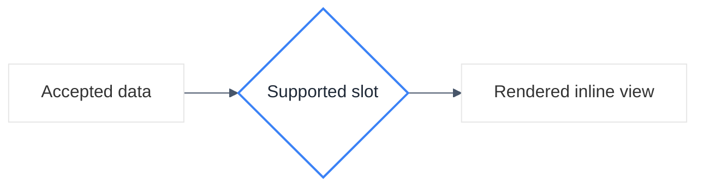

# Styling Guidance

Use a neutral, renderer-compatible theme directive and only limited classes.

- Prefer a single layout direction and no more than one optional `classDef`.
- Keep colors readable in Markdown renderers and avoid service icons or custom SVG.
- Let the renderer capability decide whether the target slot accepts Mermaid and whether the fence validates.
