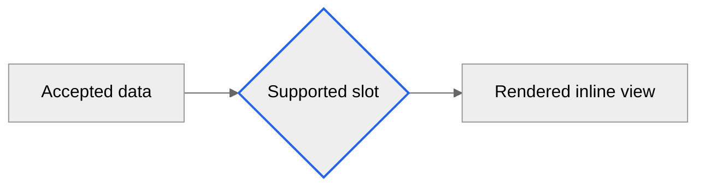

# Styling Guidance

Use a renderer-compatible neutral theme and limited semantic classes. Meaning must remain clear without color.

## Styling Rules

- Prefer one layout direction, consistent node shapes, and a small semantic class set.
- Use shape, border, and text labels together; never encode status or severity by color alone.
- Keep contrast readable in light and dark Markdown renderers. Use renderer-projected colors when available.
- Use subgraphs only for accepted ownership, trust, lifecycle, or resource boundaries.
- Keep edge labels short and place detail in surrounding prose when the slot permits it.
- Avoid service icons, custom SVG, background images, animations, click actions, and external CSS.
- Do not use emoji as the only identifier; assistive text must carry the meaning.

## Complexity Limits

When labels overlap, crossings obscure meaning, or the renderer cannot fit the slot, reduce the diagram to its primary
accepted relationship. Split independent concerns into supported slots or use a standalone diagram capability. Do not
hide nodes or drop material edges merely to make the view attractive.

## Renderer Validation

The renderer decides whether the slot accepts Mermaid, the theme directive is supported, syntax parses, and the result
fits the document. Inspect the renderer receipt for validation errors. Model inspection, Markdown source appearance, or
a successful document request is not visual-validation evidence.
