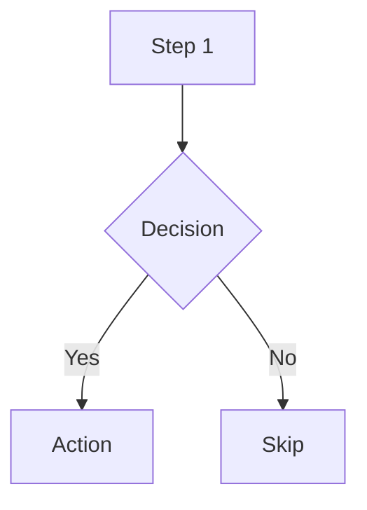
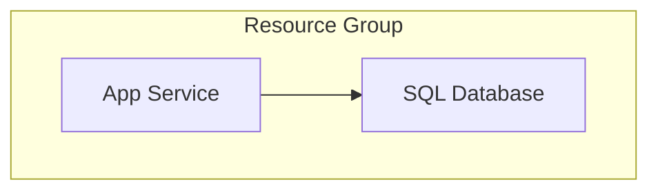
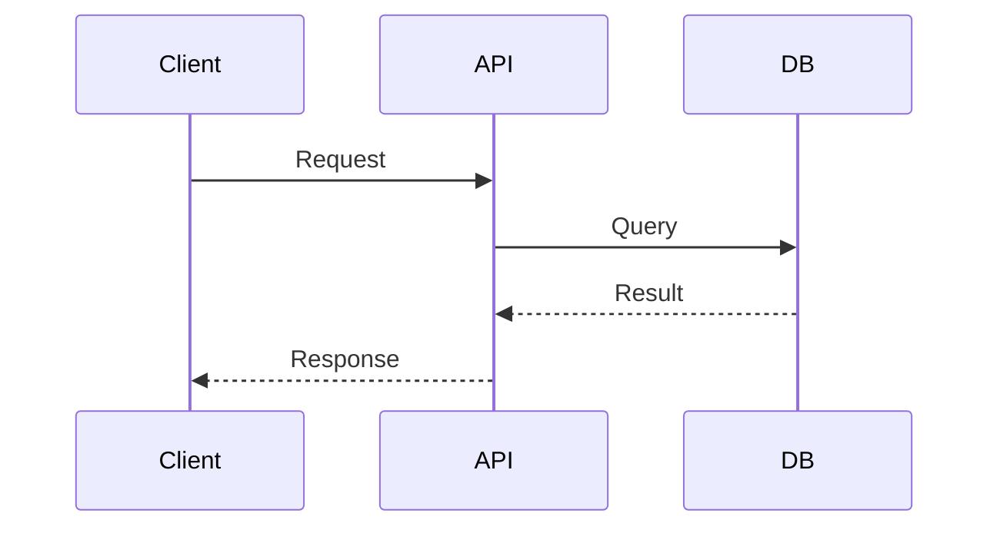
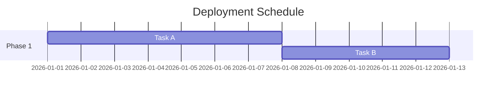
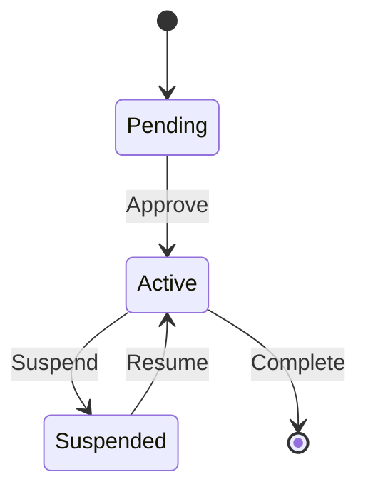
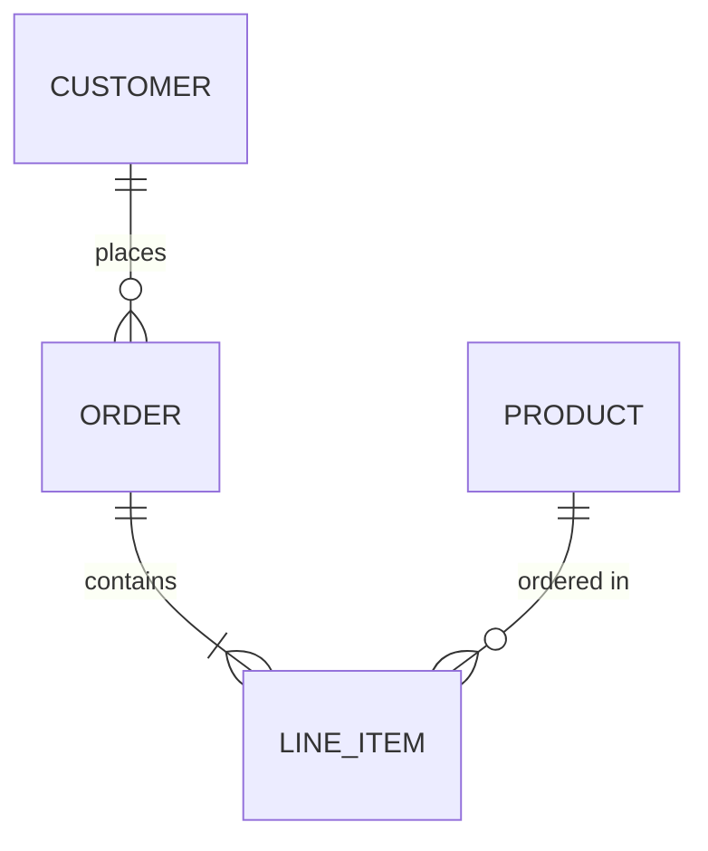

<!-- ref:mermaid-syntax-cheatsheet-v1 -->

# Mermaid Syntax Cheat Sheet

## Flowcharts

- `graph TB` for vertical layouts; `graph LR` for horizontal.
- Use subgraphs for logical grouping:

## Sequence Diagrams

## Gantt Charts

## State Diagrams

## ER Diagrams

## Azure Resource Visualization

Standalone architecture, network, runtime and as-built diagrams of live Azure resources use the kernel's Python
diagram path from accepted typed data, never Mermaid. The `apex-azure-resources` skill only interprets accepted
inventory evidence; it does not render diagrams or run Resource Graph queries. If that rendering capability or the
accepted inventory is unavailable, return the documented blocker instead of a Mermaid substitute.

### Inline Resource Relationship Conventions

Apply these only inside a registered, supported inline Markdown slot.

- Group by layer: Network, Compute, Data, Security, Monitoring
- Include resource details in node labels (use ` ` for line breaks)
- Label all connections descriptively
- Use subgraphs for logical grouping
- Connection types:
  - `-->` for data flow or dependencies
  - `-.->` for optional/conditional connections
  - `==>` for critical/primary paths

## Port Source

Adapted from [the pinned upstream
file](https://github.com/jonathan-vella/apex/blob/c209d8bb765681aa21dce5d3cd2a3b080dad8d5e/.github/skills/apex-mermaid/references/syntax-cheatsheet.md).
Load only the reference needed for the active task.
