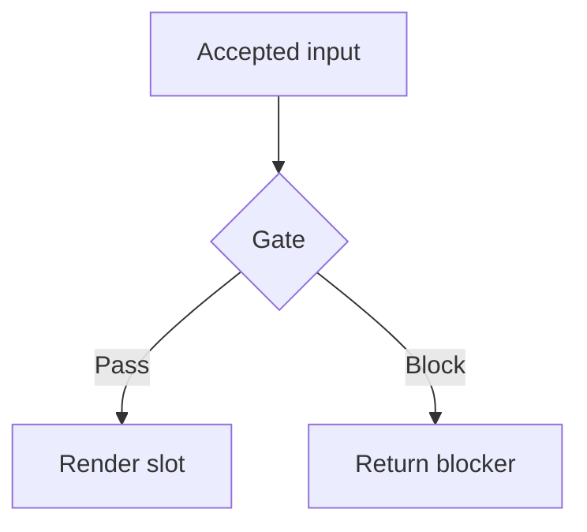
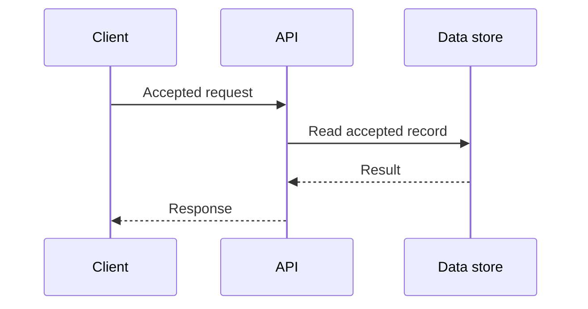
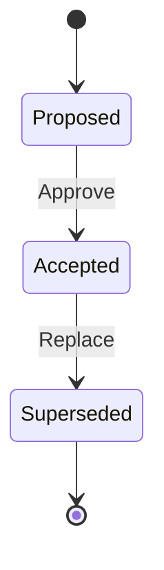
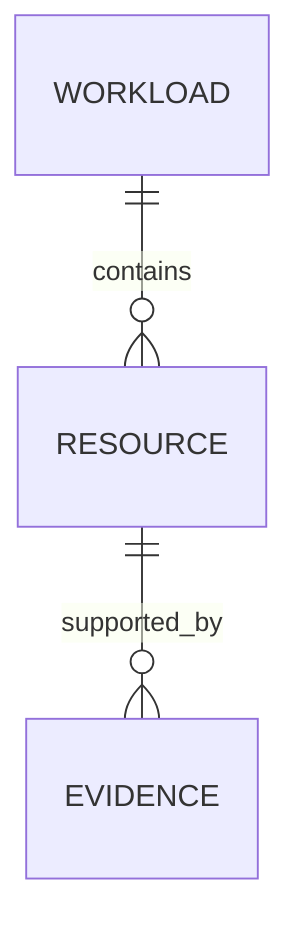
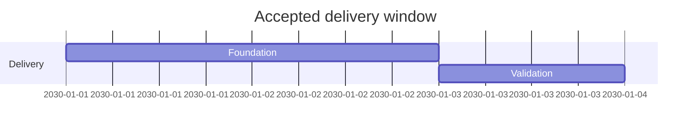

# Syntax Guidance

Use one compact diagram in a fenced `mermaid` block for a renderer-supported inline slot.

## Choose The Diagram Type

| Accepted relationship | Diagram type |
| --- | --- |
| Branching process, dependency, or decision | `flowchart` or `graph` |
| Ordered interaction among actors | `sequenceDiagram` |
| Lifecycle states and transitions | `stateDiagram-v2` |
| Entity relationships and cardinality | `erDiagram` |
| Dated tasks and dependencies | `gantt` |

Use a standalone diagram capability for architecture, network, runtime, as-built, WAF, cost, or compliance visuals.

## Flowchart

Use `TB` for vertical flows and `LR` for short horizontal flows. Group related nodes only when an accepted boundary
exists. Use `-->` for primary flow, `-.->` for an accepted optional relationship, and `==>` sparingly for an accepted
critical path. Label decisions and non-obvious edges.

## Sequence

Declare participants in first-use order. Use solid arrows for calls and dashed arrows for responses. Do not invent
authentication, retries, timing, or failure paths absent from accepted data.

## State

Use explicit transition labels and only accepted states. Avoid modeling an action as a state or implying a transition
the kernel does not authorize.

## Entity Relationship

Use accepted cardinality. Keep entity and relationship names concise; do not expose sensitive field values.

## Gantt

Use dates and durations only from accepted schedule data. A Gantt chart is a presentation, not authorization or proof
that a task started or completed.

## Safe Identifiers And Labels

- Use short, unique ASCII IDs; keep human-readable text in quoted labels or participant aliases.
- Keep labels factual and concise. Use renderer-supported line breaks only when validation confirms them.
- Avoid reserved keywords as IDs, duplicate IDs, unescaped quote characters, raw URLs, and HTML labels.
- Preserve accepted relationship direction; do not reverse arrows to improve layout.
- Omit unavailable values rather than inserting placeholders or guessed nodes.

## Troubleshooting

| Renderer finding | Correction |
| --- | --- |
| Parse error near label | Replace the display label with a quoted label and a simple ASCII ID. |
| Duplicate or merged nodes | Give every semantic node a unique ID while retaining its accepted display label. |
| Unsupported directive or diagram | Use the renderer-supported syntax or return an unsupported-capability blocker. |
| Unreadable dense graph | Split by accepted concern or use the standalone diagram capability. |
| Relationship appears wrong | Check the accepted source mapping; never fix layout by changing semantics. |
