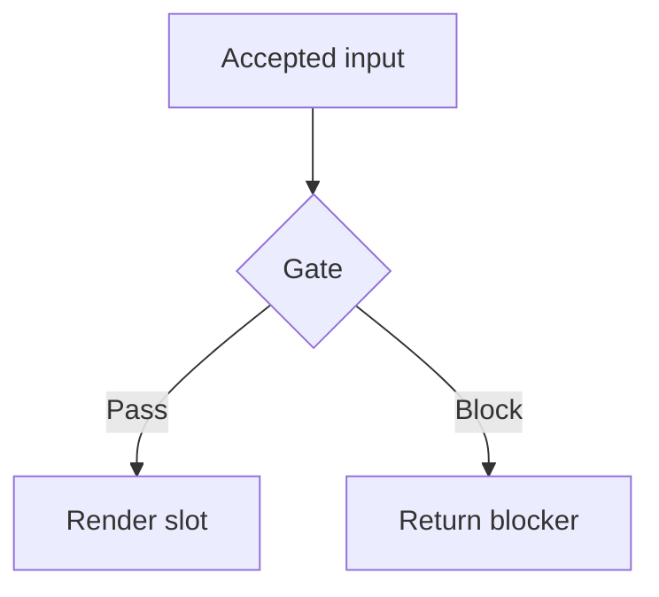

# Syntax Guidance

Use one compact diagram in a fenced `mermaid` block for a renderer-supported inline slot.

- Use `graph TB` for a vertical flow or `graph LR` for a short horizontal flow.
- Use descriptive node labels and labeled decision edges.
- Use `sequenceDiagram`, `stateDiagram-v2`, `erDiagram`, or `gantt` only when the accepted data fits that form.
- Keep relationships and labels factual; omit information that is unavailable from accepted artifacts.
